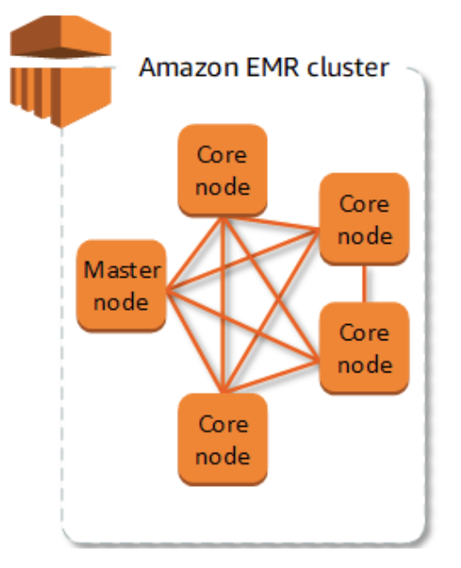
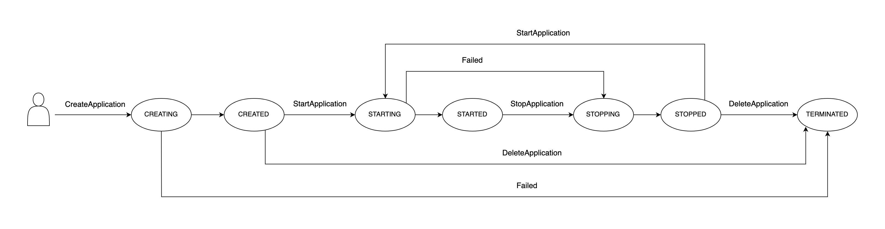
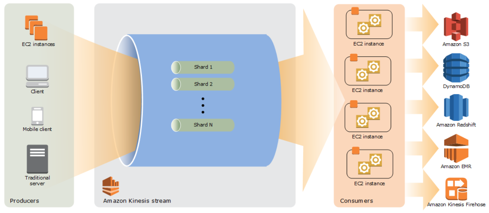
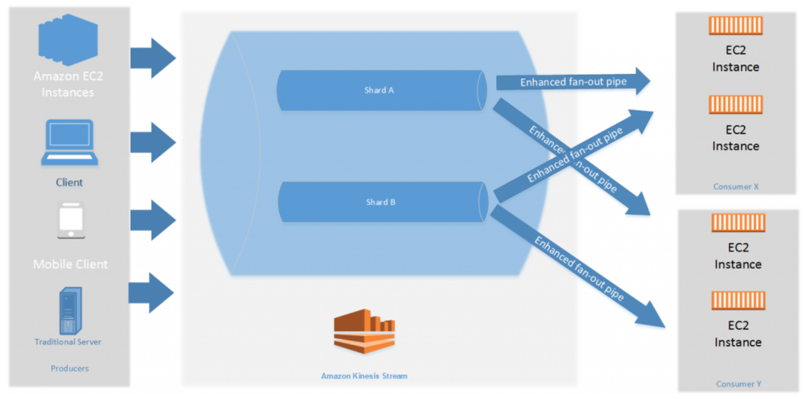
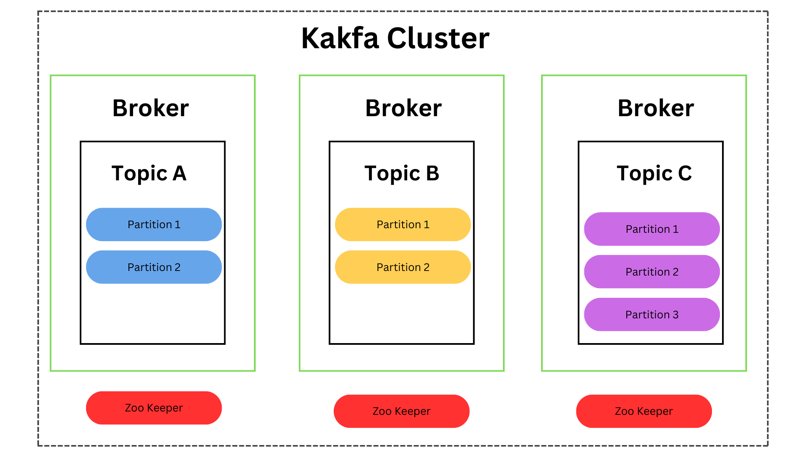
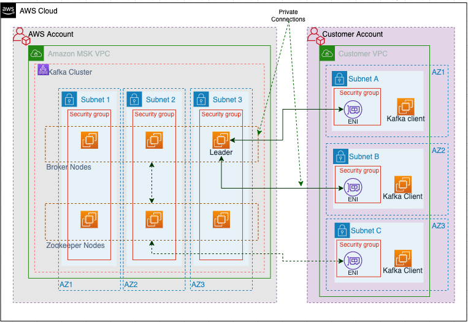
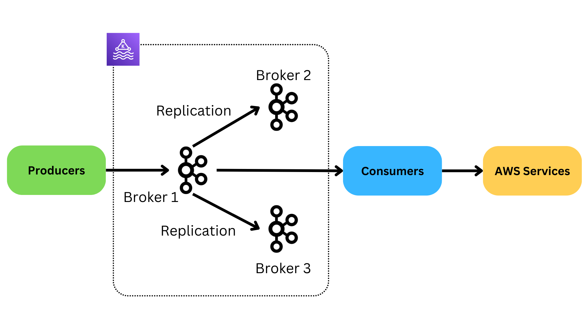
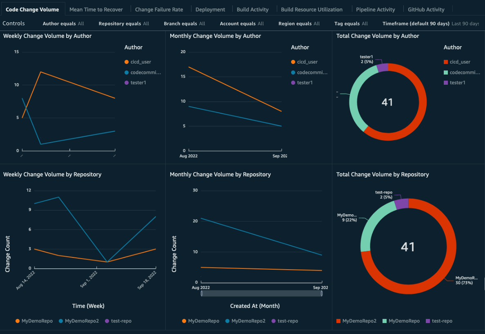
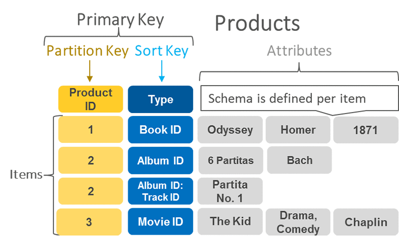

# Hands On AWS Certified Data Engineer - Associate (DEA-C01) Full Course 

# Disclaimer 
This course, youtube video, revision/exam guide, and/or slide deck for the AWS Certified Data Engineer certification is intended as a supplementary resource to aid in your preparation for the certification exam. While it is designed to help you identify and address knowledge gaps, it does not guarantee a passing score. Success on the exam depends on your understanding of the material, practical experience, and familiarity with AWS services and best practices. We recommend using this guide alongside other study materials and hands-on practice to enhance your readiness for the certification exam.

# Introduction 

This github contains the code for the [youtube video](https://youtu.be/6G0bLDIcO7Y). The youtube video acts as a revision aid for the AWS Certified Data Engineer - Associate (DEA-C01) certfication exam. The repo contains the code alongside a detailed README that gives definitions of teh AWS services and other areas of knowledge required for the certification. 

[AWS Data Engineer - Associate DEA-C01 Revision Guide](https://buymeacoffee.com/johnnychivers/e/296836)

[Udemy Pratice Exams](https://www.udemy.com/course/practice-exams-aws-certified-data-engineer-associate-johnny-chivers/?referralCode=B90E92C8A12AFA2E45C7)

# Setup

The set-code.yaml contains code to be executed using Amazon CloudFormation. The code creates the base networking artefacts and S3 Bucket required to complete the remaining sections of the course. The S3 Bucket will require a name which is globally unique to AWS to be entered before executing the stack. 

The following artefacts are created by the code; 
- VPC 
- Two public Subnets 
- Security Groups 
- Routing Table 
- S3 Bucket

After the code has been executed the following steps need to be executed on the console. 

1. Create a `rawData` data folder in the S3 bucket.  
2. Create a `processedData` folder in the S3 bucket.
3. Create a `scriptLocation` folder in the S3 bucket.
4. Create a `tmpDir` folder in the S3 bucket.
5. Create a `athena` folder in the S3 bucket.
6. Upload source data into the `rawData` folder maintaining folder structure of customers, employees, and orders, .  

The S3 bucket should have the follow structure once set up; 

```
└── S3-Bucket-Name
    ├── athena
    ├── processedData
    ├── rawData
    │   ├── customers 
    │   │   └──  customers.csv 
    │   ├── employees 
    │   │   └──  employees.csv 
    │   └── orders
    │       └── orders.csv 
    ├── scriptLocation    
    └──  tmpDir
```

# AWS Glue 

## AWS Glue Introduction

AWS Glue is a serverless data integration service that makes it easier to discover, prepare, and combine data for analytics, machine learning (ML), and application development. AWS Glue provides all the capabilities needed for data integration, so you can start analyzing your data and putting it to use in minutes instead of months. AWS Glue provides both visual and code-based interfaces to make data integration easier. Users can more easily find and access data using the AWS Glue Data Catalog. Data engineers and ETL (extract, transform, and load) developers can visually create, run, and monitor ETL workflows in a few steps in AWS Glue Studio. Data analysts and data scientists can use AWS Glue DataBrew to visually enrich, clean, and normalize data without writing code.

In this section we will learn how to register data in theGlue Data Catalog so we can perform ETL on data We will use Glue Visual ETL editor to create an script which will be executed on demand, and via a schedule, from the AWS Glue console. 

## Setup for AWS Glue Tutorial 
For the following Glue Tutorial and accompanying youtube video we will complete the following setup work. 

1. Run the glue.yaml file in cloudformation 
2. Upload the employees_headers/employees.csv to the `rawData' folder in the S3 Bucket 
3. Upload the orders_headers/orders.csv to the `rawData' folder in the S3 Bucket 

The Cloudformation script will create a Glue Service role required throughout the glue tutorial. The headers folders/csv is required for the AWS Glue Crawler. These files contain headers in the first row, unlike the data we unload as part of the initial setup work. The AWS Glue Crawler will infer headers from these files. 

## Data
Below is the schema for the table that wil be created in the Glue Data Catalog which includes a sample of the data.

**Customers**
| Customerid      | Firstname | Lastname| Fullname |
| ----------- | ----------- |-----------|-----------|
|  293 | Catherine                | Abel                   | Catherine Abel                 |
|  295 | Kim                      | Abercrombie            | Kim Abercrombie                |
|  297 | Humberto                 | Acevedo                | Humberto Acevedo               |

**Orders**

|  SalesOrderID |  SalesOrderDetailID |  OrderDate |  DueDate  | ShipDate | EmployeeID | CustomerID | SubTotal | TaxAmt | Freight | TotalDue | ProductID | OrderQty | UnitPrice | UnitPriceDiscount | LineTotal |
|---------------|---------------|---------------|---------------|---------------|---------------|---------------|---------------|---------------|---------------|---------------|---------------|---------------|---------------|---------------|---------------|
| 71782 | 110667 | 5/1/2014   | 5/13/2014  | 5/8/2014  | 276 |  293 |   33319.986 |  3182.8264 |  994.6333 | 37497.4457 | 714 |  3 |    29.994 |    0 |      89.982 |
| 44110 |   1732 | 8/1/2011   | 8/13/2011  | 8/8/2011  | 277 |  295 |  16667.3077 |  1600.6864 |  500.2145 |  18768.2086 | 765 |  2 |  419.4589 |    0 |    838.9178 |
| 44131 |   2005 | 8/1/2011   | 8/13/2011  | 8/8/2011  | 275 |  297 |  20514.2859 |  1966.5222 |  614.5382 |  23095.3463 | 709 |  6 |       5.7 |    0 |        34.2 |

**Employees**

| EmployeeID | ManagerID | FirstName | LastName | FullName  | JobTitle | OrganizationLevel | MaritalStatus  | Gender | Territory | Country | Group |      
|------------|------------|------------|------------|------------|------------|------------|------------|------------|------------|------------|------------|
| 276 |  274 | Linda   | Mitchell          | Linda Mitchell           | Sales Representative         | 3 | M | F | Southwest      | US   | North America |
| 277 |  274 | Jillian | Carson            | Jillian Carson           | Sales Representative         | 3 | S | F | Central        | US   | North America |
| 275 |  274 | Michael | Blythe            | Michael Blythe           | Sales Representative         | 3 | S | M | Northeast      | US   | North America |


## AWS Glue Data Catalog 

The AWS Glue Data Catalog is your persistent technical metadata store. It is a managed service that you can use to store, annotate, and share metadata in the AWS Cloud.

In this section we will catalog the data we uplaoded to S3 during the setup stage. 

## Glue Data Catalog Databases 
An AWS Glue Database is a set of associated Data Catlog table definitions organized into a logical group. An AWS Glue database can contain many tables, and each table must be associated with a single database.

In the youtube video we will create two databases
1. `raw_data`
2. `processed_data`

## Glue Data Catalog Tables 
AWS Glue Tables are the metadata definition that represents data. The data resides in its orginal store. This is just a representation of the schema. Tables can be added manually through the AWS Console and/or the AWS Glue Crawler. 

In the youtube video we will manually create the customers table before using an AWS Crawler to setup the remaining table. 

Below is the schema for the customer table. 
```
    customerid  INT
    firstname   STRING
    lastname    STRING
    fullname    STRING
```

## AWS Glue Crawler 
You can use an AWS Glue crawler to populate the AWS Glue Data Catalog with databases and tables. This is the primary method used by most AWS Glue users. A crawler can crawl multiple data stores in a single run. Upon completion, the crawler creates or updates one or more tables in your Data Catalog. Extract, transform, and load (ETL) jobs that you define in AWS Glue use these Data Catalog tables as sources and targets. The ETL job reads from and writes to the data stores that are specified in the source and target Data Catalog tables.

The accompanying youtube video details how this can be done. 

Below is the schema for the employees table. 
```
    employeeid        INT
    managerid         INT
    firstname         STRING
    lastname          STRING
    fullname          STRING
    jobtitle          STRING   
    organizationlevel INT
    maritalstatus     STRING 
    gender            STRING
    territory         STRING
    country           STRING
    group             STRING
```

Below is the schema for the orders table. 
```
salesorderid        INT
salesorderdetailid  INT
orderdate           STRING
duedate             STRING
shipdate            STRING
employeeid          INT 
customerid          INT 
subtotal            DOUBLE
taxamt              DOUBLE
freight             DOUBLE
totaldue            DOUBLE
productid           INT
orderqty            INT
unitprice           DOUBLE
unitpricediscount   DOUBLE
linetotal           DOUBLE
``` 

## AWS Glue Connections

A Data Catalog object that contains the properties that are required to connect to a particular data store. Glue Connections can be used to connect to RDS, Redshift, S3, and other datastores. The connections can be used repeatedly throughout ETL code to avoid hard coding connection string details into scripts. 

## Partitions in AWS 
Partitions are folders where data is stored in S3, which are physical entities are mapped to partitions, which are logical entities i.e. Columns in the Glue Table. 

## AWS Glue ETL 
An AWS Glue job encapsulates a script that connects to your source data, processes it, and then writes it out to your data target. Typically, a job runs extract, transform, and load (ETL) scripts. Jobs can run scripts designed for Apache Spark and Ray runtime environments. Jobs can also run general-purpose Python scripts (Python shell jobs.) AWS Glue triggers can start jobs based on a schedule or event, or on demand. You can monitor job runs to understand runtime metrics such as completion status, duration, and start time.

You can use scripts that AWS Glue generates or you can provide your own. With a source schema and target location or schema, the AWS Glue Studio code generator can automatically create an Apache Spark API (PySpark) script. You can use this script as a starting point and edit it to meet your goals.

AWS Glue can write output files in several data formats. Each job type may support different output formats. For some data formats, common compression formats can be written.

In this section of the accompaning video we will look at how we can author an ETL scipt using the visual editor on the AWS Glue Console. 

## Scheduling An AWS Glue Job 

### AWS Glue Scheduler 
The AWS Glue Scheduler initiates an ELT job. Triggers can be defined based on a scheduled time or event. 

In this section of the accompaning video we will look at how we can schedule jobs use the AWS Glue Scheduler. 

### AWS Glue Workflows 
AWS Glue Workflows is an orchestration tool involving multiple crawlers, jobs and triggers. Each workflow manages the execution and monitoring of all its jobs and crawlers. A workflow runs each component, it records execution progress and status. This provides you with an overview of the larger task and the details of each step.

In this section of the accompaning video we will look at how we can schedule jobs use AWS Glue Workflows. 

### Other Methods of Scheduling a Glue Job

#### Managed Workflows For Apache Airflow 
Amazon Managed Workflows for Apache Airflow is a managed orchestration service for Apache Airflow that you can use to setup and operate data pipelines in the cloud at scale. Apache Airflow is an open-source tool used to programmatically author, schedule, and monitor sequences of processes and tasks referred to as workflows. With Amazon MWAA, you can use Apache Airflow and Python to create workflows without having to manage the underlying infrastructure for scalability, availability, and security. Amazon MWAA automatically scales its workflow execution capacity to meet your needs, Amazon MWAA integrates with AWS security services to help provide you with fast and secure access to your data.

You will be expected to know how MWAA can be used to schedule AWS Glue and other aws services. 

#### AWS Step Functions 
Step Functions is a visual workflow service that helps developers use AWS services to build distributed applications, automate processes, orchestrate microservices, and create data and machine learning (ML) pipelines. https://docs.aws.amazon.com/step-functions/latest/dg/connect-glue.html

You will be expected to know how AWS Step Functions  can be used to schedule AWS Glue and other aws services. 

#### Amazon Event Bridge 
EventBridge is a serverless service that uses events to connect application components together, making it easier for you to build scalable event-driven applications. Event-driven architecture is a style of building loosely-coupled software systems that work together by emitting and responding to events. Event-driven architecture can help you boost agility and build reliable, scalable applications.

Use EventBridge to route events from sources such as home-grown applications, AWS services, and third-party software to consumer applications across your organization. EventBridge provides simple and consistent ways to ingest, filter, transform, and deliver events so you can build applications quickly.

https://aws.amazon.com/about-aws/whats-new/2021/07/announcing-availability-event-driven-workflows-aws-glue-amazon-eventbridge/

You will be expected to know how Amazon Event Bridge can be used to schedule AWS Glue and other aws services. 

## AWS Glue Data Quality 

AWS Glue Data Quality allows you to measure and monitor the quality of your data so that you can make good business decisions. Built on top of the open-source DeeQu framework, AWS Glue Data Quality provides a managed, serverless experience. AWS Glue Data Quality works with Data Quality Definition Language (DQDL), which is a domain specific language that you use to define data quality rules.

In this section of the youtube video we cover things you may need to know Amazon Glue Data Brew do for the AWS Certified Data Engineer - Associate (DEA-C01). We will use the data we have registered in the Glue Data Catalog to build our own Glue Data Qaulity Rules. 

## AWS Glue Data Brew 

AWS Glue DataBrew is a visual data preparation tool that makes it easier for data analysts and data scientists to clean and normalize data to prepare it for analytics and machine learning (ML). You can choose from over 250 prebuilt transformations to automate data preparation tasks, all without the need to write any code. You can automate filtering anomalies, converting data to standard formats and correcting invalid values, and other tasks. 

In this section of the youtube video we cover things you may need to know Amazon Glue Data Brew do for the AWS Certified Data Engineer - Associate (DEA-C01). We will use the data we have registered in the Glue Data Catalog and explore it using AWS Glue Data Brew. 

## Other AWS Glue Things you should Know

In this section of the youtube video we cover other things you may need to know about AWS Glue for the AWS Certified Data Engineer - Associate (DEA-C01). 

Glue Bookmarks tracks data that has already been processed during a previous run of an ETL job by persisting state information from the job run. This persisted state information is called a job bookmark. 

A single standard DPU provides 4 vCPU and 16 GB of memory whereas a high-memory DPU (M-DPU) provides 4 vCPU and 32 GB of memory.

# Amazon Athena 

## Amazon Athena Introduction
Amazon Athena is a serverless, interactive analytics service built on open-source frameworks, supporting open-table and file formats. Athena provides a simplified, flexible way to analyze petabytes of data where it lives. Analyze data or build applications from an Amazon Simple Storage Service (S3) data lake and 30 data sources, including on-premises data sources or other cloud systems using SQL or Python. Athena is built on open-source Trino and Presto engines and Apache Spark frameworks, with no provisioning or configuration effort required.

As part of the exam you will have to know some basic SQL functuions which will be covered in this section. 

## Data
Below are the schemas for the tables that wil be created in the Glue Data Catalog. They also include a small sample of data to aid the explaination of the coding syntax.

**Customers**
| Customerid      | Firstname | Lastname| Fullname |
| ----------- | ----------- |-----------|-----------|
|  293 | Catherine                | Abel                   | Catherine Abel                 |
|  295 | Kim                      | Abercrombie            | Kim Abercrombie                |
|  297 | Humberto                 | Acevedo                | Humberto Acevedo               |

**Orders**

|  SalesOrderID |  SalesOrderDetailID |  OrderDate |  DueDate  | ShipDate | EmployeeID | CustomerID | SubTotal | TaxAmt | Freight | TotalDue | ProductID | OrderQty | UnitPrice | UnitPriceDiscount | LineTotal |
|---------------|---------------|---------------|---------------|---------------|---------------|---------------|---------------|---------------|---------------|---------------|---------------|---------------|---------------|---------------|---------------|
| 71782 | 110667 | 5/1/2014   | 5/13/2014  | 5/8/2014  | 276 |  293 |   33319.986 |  3182.8264 |  994.6333 | 37497.4457 | 714 |  3 |    29.994 |    0 |      89.982 |
| 44110 |   1732 | 8/1/2011   | 8/13/2011  | 8/8/2011  | 277 |  295 |  16667.3077 |  1600.6864 |  500.2145 |  18768.2086 | 765 |  2 |  419.4589 |    0 |    838.9178 |
| 44131 |   2005 | 8/1/2011   | 8/13/2011  | 8/8/2011  | 275 |  297 |  20514.2859 |  1966.5222 |  614.5382 |  23095.3463 | 709 |  6 |       5.7 |    0 |        34.2 |

**Employees**

| EmployeeID | ManagerID | FirstName | LastName | FullName  | JobTitle | OrganizationLevel | MaritalStatus  | Gender | Territory | Country | Group |      
|------------|------------|------------|------------|------------|------------|------------|------------|------------|------------|------------|------------|
| 276 |  274 | Linda   | Mitchell          | Linda Mitchell           | Sales Representative         | 3 | M | F | Southwest      | US   | North America |
| 277 |  274 | Jillian | Carson            | Jillian Carson           | Sales Representative         | 3 | S | F | Central        | US   | North America |
| 275 |  274 | Michael | Blythe            | Michael Blythe           | Sales Representative         | 3 | S | M | Northeast      | US   | North America |

## Set Up 
1. We will use three data sets uploaded in the main setup section
2. Run the athena.yaml script in Cloudformation. Athena will need a location to store results in S3. We Will use the `athena` folder created in the initial setup which we will enter as a results location when running the Cloudformation script. 
3. We will create a new databse in the Athena Query editor to use. 
```
CREATE DATABASE demo_data; 
```

## Main Tutorial 
1. Create Customer Table
```
CREATE EXTERNAL TABLE IF NOT EXISTS customers(
  customerid BIGINT, 
  fistname STRING,
  lastname STRING,
  fullname STRING
  )
ROW FORMAT DELIMITED
FIELDS TERMINATED BY ','
STORED AS TEXTFILE
LOCATION 's3://table-data-location/'; 
```
2. Select all rows from cusomters table 
```
SELECT * FROM customers;
```
3. select a column from customer table 
```
SELECT Firstname FROM customers;
```
4. column alais 
```
SELECT Firstname as f_name FROM customers;
```
5. Concat two columns of the same data type and alais 
```
SELECT CONCAT(firstname,lastname) AS full_name FROM customer;
```
6. Use a WHERE clause to filter data 
```
SELECT Firstname FROM customers WHERE firstname = 'John' ;
```
7. Use an AND/OR clause to filter data 
```
SELECT * FROM customers WHERE firstname = 'John'  AND lastname = 'Arthur';

SELECT * FROM customers WHERE firstname = 'John' or lastname = 'Arthur';
```
8. Use an in clause to filter data 
```
SELECT * FROM customers WHERE Customerid in (371) 

SELECT * FROM customers WHERE Customerid in (371, 377);
```
9.  Wild Cards
```
SELECT * FROM customers WHERE Fullname like 'J%'; 
```
10. Union 
```
SELECT Firstname FROM customers WHERE Customerid in (371) 
UNION
SELECT Firstname FROM customers WHERE Customerid in (371, 377);
```
11. INSERT A ROW
```
INSERT INTO customers (customerid, firstname, lastname, fullname) values (1221,'John', 'Doe', 'John Doe'); 
```
12. DISTINCT 
```
SELECT DISTINCT firstname FROM customers WHERE firstname like 'J%';
```
13. COUNT 
```
SELECT count(firstname) FROM customers WHERE firstname like 'J%';
```
14. COUNT DISTINCT
```
SELECT count(DISTINCT firstname) FROM customers WHERE firstname like 'J%';
```
15. GROUP BY 
```
SELECT firstname FROM customers WHERE firstname like 'J%' group by firstname;
```
16. NESTED QUERIES
```
SELECT * FROM customers WHERE customerid in (SELECT customerid from customers);
```
17. COMMON TABLE EXPRESSIONS (cte's)
```
with cte as 
(
SELECT firstname, lastname, CONCAT(firstname,' ',lastname)
FROM customers
)
SELECT * 
FROM customers; 
```
18. INNER JOIN
```
CREATE EXTERNAL TABLE IF NOT EXISTS employees(
employeeid  bigint,
managerid bigint,
firstname string,
lastname string , 
fullname  string,
jobtitle string,    
organizationlevel int   , 
maritalstatus string, 
gender string,
territory string,
country string,
group string 
)
ROW FORMAT DELIMITED
FIELDS TERMINATED BY ','
STORED AS TEXTFILE
LOCATION 's3://table-data-location/'; 
```
```
CREATE EXTERNAL TABLE IF NOT EXISTS orders(
salesorderid bigint,
salesorderdetailid int,
orderdate string,
duedate string,
shipdate string,
employeeid bigint,
customerid bigint,
subtotal decimal(17,4),
taxamt decimal(17,4),
freight decimal(17,4),
totaldue decimal(17,4),
productid  int,
orderqty int,
unitprice decimal(17,4),
unitpricediscount decimal(17,4),
linetotal decimal(17,4)
)
ROW FORMAT DELIMITED
FIELDS TERMINATED BY ','
STORED AS TEXTFILE
LOCATION 's3://table-data-location/'; 
```
```
SELECT * FROM customers INNER JOIN orders on customers.customerid = orders.customerid; 
```
19. LEFT JOIN 
```
SELECT * FROM order LEFT JOIN customers on customers.customerid = orders.customerid; 
```

# Amazon Redshift

## Amazon Redshift Intro and Architecture 
Amazon Redshift is a fast, fully managed, petabyte-scale data warehouse service that makes it simple and cost-effective to efficiently analyze all your data using your existing business intelligence tools. It is optimized for datasets ranging from a few hundred gigabytes to a petabyte or more and costs less than $1,000 per terabyte per year, a tenth the cost of most traditional data warehousing solutions.

Amazon Redshift is designed for Online Analytical Processing (OLTP) workloads and can give up to 10x better performance than other data warehousing solutions by scaling up/down on demand with built in replication and backups. Amazon Redshift can be queried using Structured Query Language (SQL) using the online query editor via the AWS console and/or your own preferred client using JDBC and ODBC. Amazon Redshift can be monitored through Amazon Cloudwatch and Amazon Cloudtrail. 

Common Usecases; 

- Analytical workloads 
- Unifying Data Warehouse 
- Stock Analysis 
- Gaming Data 
- Social Trends 

## Amazon Redshift Theory 

### Amazon Redshift Durability and Scaling 
Data is replicated within an Amazon Redshift Cluster making it highly durable and can also be backed up to S3 with automated snapshots. This S3 snapshot can also be asynchronously replicated to another AWS regions for disaster recovery. A Redshift cluster is limited to a single AZ, except when running on the RA3 instance type. 

Amazon Redshift can be scaled both horizontally and vertically. There are 3 main way to resize a redshift cluster. 

1/ Elastic Resizing. This quickly adds or removes nodes of the same instance type from a Amazon Redshift cluster. Typically a cluster is only down for a few minutes during this resizing operation and Amazon Redshift attempts to maintain open connections. The number of nodes present in a cluster for some DC2 and RA2 node types can only be doubled/halved. 

2/ Classic Resize. This allows for both a change in instance type (vertical scaling) and a change in overall node count (horizontal scaling). This process can take several hours and even days. During this time the cluster is only available in read only mode. 

3/ Snapshot and Restore. In order to keep your cluster available a user can take a snapshot of the cluster and restore this to a new cluster which is configured the same as this existing cluster. All traffic can then be sent to the new Amazon Redshift cluster. A classic resize can then be executed on the original cluster which will enter a read only mode. Once the resize is complete traffic can be switched back to the original cluster which has now been successfully resized. The second cluster can be span down. 

### Amazon Redshift Key Distribution 
When a table is created in Amazon Redshift there are four possible row distribution styles to be designated from; Auto, Even, Key, All. Each distribution style has its advantages and disadvantages, therefore careful consideration should be given. 

1/ AUTO distribution. Amazon Redshift assigns the optimal distribution style for the table and will change this overtime based on the nature of the data which is being ingested into the table. For example, if a small number of rows are ingested at when the table is initially created then Amazon Redshift may use the ALL distribution style. Overtime as the volume of data, and rows, in the table increases Amazon Redshift may change the distribution style to Key or Even. Amazon Redshift implements this change in the background with minimal impact to user queries. 

2/ EVEN distribution. The rows are distributed across the slices in a round robin fashion regardless of any values stored in the columns. This is an appropriate choice when the table does not participate in joins, or there is no clear choice between KEY and ALL distributions. 

3/ KEY distribution. The rows are distributed according to the values in one column. Column which contain the same value are placed on the same slice and are stored together physically on disk. KEY distribution should be chosen when a table is not small and is used to perform joins. 

4/ ALL distribution. The table is copied in full to every node of the Amazon Redshift cluster. This should be used when the data in tables is slow moving, as it takes significantly longer to load, update, and insert data into a table which has the ALL distribution applied. ALL distribution ensures that all the table data is collated on a single node for joins. 

### Redshift Data Ingest/Export and Copy/Unload Command 
The COPY command is the most common way to ingest data into Amazon Redshift as it can load data using parallelisation. The COPY command loads data into a table from data files or from an Amazon DynamoDB table. The files can be located in an Amazon Simple Storage Service (Amazon S3) bucket, an Amazon EMR cluster, or a remote host that is accessed using a Secure Shell (SSH) connection. The COPY command can decrypt the data and unzip files when loading into tables. The COPY Command will also automatically compress the data as it is stored on Amazon Redshift. The parallelisation functionality allows the COPY command to ingest large volumes of data into a Redshift Table by loading multiple files at once. N.B. When a table is narrow, i.e. consists of limit columns, but has a large volume of rows a single COPY command should be issued to load the data and parallelisation should be ignored. 
```
COPY table-name 
[ column-list ]
FROM data_source
authorization
[ [ FORMAT ] [ AS ] data_format ] 
[ parameter [ argument ] [, ... ] ]
```
Data can be automatically ingested from S3 using the Auto Copy from S3 feature. A COPY command is triggered when a new file is added to S3 automating the ingest process. 

Zero ETL from Aurora RDS to Amazon Redshift removes the need for a user to create and maintain ETL pipelines. Data is automatically ingested from Aurora to Amazon Redshift without the use of any self managed ETL infrastructure. 

Data can also be streamed into Amazon Redshift from Amazon Kinesis and Amazon MSK. 

Data can also be copied from Amazon Redshift Cluster in one region to an Amazon Redshift Cluster in a different region. (N.B. This comes up on the exam a lot - you should know the process to carry this out). 1/ Create a KMS key in the destination region. 2/ Specify a unique name for your snapshot copy grant in the destination region. 3/ Specify the KMS Key ID for which you are creating for the Copy grant in your destination region. 4/ In the source region enable copying of snapshots to the copy grant you just created. 

Data can be exported from Amazon Redshift using the UNLOAD command. The command unloads the result of a query to one or more text, JSON, or Apache Parquet files on Amazon S3, using Amazon S3 server-side encryption (SSE-S3). You can also specify server-side encryption with an AWS Key Management Service key (SSE-KMS) or client-side encryption with a customer managed key.
```
UNLOAD ('select-statement')
TO 's3://object-path/name-prefix'
authorization
[ option, ...] 

where authorization is
IAM_ROLE { default | 'arn:aws:iam::<AWS account-id-1>:role/<role-name>[,arn:aws:iam::<AWS account-id-2>:role/<role-name>][,...]' }
            
where option is
| [ FORMAT [ AS ] ] CSV | PARQUET | JSON
| PARTITION BY ( column_name [, ... ] ) [ INCLUDE ]
| MANIFEST [ VERBOSE ]
| HEADER
| DELIMITER [ AS ] 'delimiter-char'
| FIXEDWIDTH [ AS ] 'fixedwidth-spec'
| ENCRYPTED [ AUTO ]
| BZIP2
| GZIP
| ZSTD
| ADDQUOTES
| NULL [ AS ] 'null-string'
| ESCAPE
| ALLOWOVERWRITE
| CLEANPATH
| PARALLEL [ { ON | TRUE } | { OFF | FALSE } ]
| MAXFILESIZE [AS] max-size [ MB | GB ]
| ROWGROUPSIZE [AS] size [ MB | GB ]
| REGION [AS] 'aws-region' }
| EXTENSION 'extension-name'

```

### Redshift Integrations
Redshift integrates with other AWS services such as S3, DynamoDB, EMR, and EC2. 

### Redshift Vacuum
The Amazon Redshift Vacuum command recovers space from deleted rows. There are four Vacuum commands. 

1/ Vacuum Full. This command recovers space from deleted rows and resorts the rows.  
2/Vacuum Delete Only. This command recovers space from delete rows only. 
3/ Vacuum Sort Only. This command resorts rows only. 
4/ Vacuum ReIndex. Sorts Key columns from an index. 


### Redshift Workload Management (WLM) 
Amazon Redshift workload management (WLM) enables users to flexibly manage priorities within workloads so that short, fast-running queries won't get stuck in queues behind long-running queries.

When users run queries in Amazon Redshift, the queries are routed to query queues. Each query queue contains a number of query slots. Each queue is allocated a portion of the cluster's available memory. A queue's memory is divided among the queue's query slots. You can enable Amazon Redshift to manage query concurrency with automatic WLM or manually configure WLM. 

Automatic WLM determines the amount of resources that queries need and adjusts the concurrency based on the workload. When queries requiring large amounts of resources are in the system (for example, hash joins between large tables), the concurrency is lower. When lighter queries (such as inserts, deletes, scans, or simple aggregations) are submitted, concurrency is higher. Up to 8 queues can be created and fof each queue Priority, Concurrency scaling mode, User groups, Query groups, and Query monitoring rules can be configured. Automatic WLM is the recommended approach over Manual WLM. 

Manual Workload Management has one default queue with a concurrency level of 5 and super user queue with a currency level of 1. Up to 8 queues can be defined with a maximum concurrency level of 50. With manual WLM, a user specifies the way that memory is allocated among slots and how queries can be routed to specific queues at runtime. You can also configure WLM properties to cancel long-running queries.

Short query acceleration (SQA) prioritizes selected short-running queries ahead of longer-running queries. SQA runs short-running queries in a dedicated space, so that SQA queries aren't forced to wait in queues behind longer queries. SQA only prioritizes queries that are short-running and are in a user-defined queue. With SQA, short-running queries begin running more quickly and users see results sooner.

If you enable SQA, you can reduce workload management (WLM) queues that are dedicated to running short queries. In addition, long-running queries don't need to contend with short queries for slots in a queue, so you can configure your WLM queues to use fewer query slots. When you use lower concurrency, query throughput is increased and overall system performance is improved for most workloads.SQA works with Create Tables as (CTAS), read only queries, uses machine learning to predict query execution time and can config short in seconds. 

Concurrency Scaling feature, you can support thousands of concurrent users and concurrent queries, with consistently fast query performance. When you turn on concurrency scaling, Amazon Redshift automatically adds additional cluster capacity to process an increase in both read and write queries. Users see the most current data, whether the queries run on the main cluster or a concurrency-scaling cluster.You can manage which queries are sent to the concurrency-scaling cluster by configuring WLM queues. When you turn on concurrency scaling, eligible queries are sent to the concurrency-scaling cluster instead of waiting in a queue.


### RA3 Nodes
RA3 nodes allow for compute to be independently scaled from storage. As a result, a user can scale the  number of nodes based on performance requirements, and only pay for the managed storage that is used. This gives the flexibility to size your RA3 cluster based on the amount of data you process daily without increasing your storage costs.

### Redshift Machine Learning 
Machine learning models can be created by issuing SQL commands. This is a managed feature which can be used to create, train, and deploy machine learning models in Amazon SageMaker from the Amazon Redshift Data Warehouse. 

### Redshift Data Sharing / Data Shares
Amazon Redshift Data Sharing allows for access to live data across Amazon Redshift Clusters, Workgroups, AWS accounts and AWS Regions without manually moving or copying the data. This removes the need for complicated ETL pipelines. This is done via a producer/consumer architecture where the producer controls access to the datashare and the consumer pays for the charges related to consuming the data. To share data the cluster must use the RA3 node type. 

### Redshift Lambda UDF 
Amazon Redshift allows the use of custom AWS Lambda Function inside SQL syntax. Scalar Lambda functions can be wrote in the support languages such as; Java, Go, PowerShell, Node.js, C#, Python, and Ruby. Redshift must have permission to invoke these lambda functions, and there may be additional charges when invoking a lambda function. 

Example SQL code for invoking a Lambda function for Amazon Redshift. 
```
SELECT a, b FROM t1 WHERE lambda_multiply(a, b) = 64; SELECT a, b FROM t1 WHERE a*b = lambda_multiply(2, 32)
```

### Redshift Federated Queries
Amazon Redshift Redshift Queries allow your Redshift Cluster to access data from Amazon RDS instances. This is done by creating an external schema in Amazon Redshift which is a representation of the schema in the RDS database. Amazon Redshift can then access the data stored in the RDS instance by using credentials stored in Amazon Secrets Manager. 

Below is an example of how to connect to an Amazon PostgreSQL Aurora database. 
```
CREATE EXTERNAL SCHEMA apg
FROM POSTGRES
DATABASE 'database-1' SCHEMA 'myschema'
URI 'endpoint to aurora hostname'
IAM_ROLE 'arn:aws:iam::123456789012:role/Redshift-SecretsManager-RO'
SECRET_ARN 'arn:aws:secretsmanager:us-west-2:123456789012:secret:federation/test/dataplane-apg-creds-YbVKQw';
```

### Redshift System Tables and System Views
Amazon Redshift has many system tables and views that contain information about how the system is functioning. You can query these system tables and views the same way that you would query any other database tables

Types of system tables and views; 

- SVV views contain information about database objects with references to transient STV tables.
- SYS views are used to monitor query and workload usage for provisioned clusters and serverless workgroups.
- STL views are generated from logs that have been persisted to disk to provide a history of the system.
- STV tables are virtual system tables that contain snapshots of the current system data. They are based on transient in-memory data and are not persisted to disk-based logs or regular tables.
- SVCS views provide details about queries on both the main and concurrency scaling clusters.
- SVL views provide details about queries on main clusters.

Example of access a system table
```
select * from stv_exec_state
where currenttime > (select max(currenttime) from stv_exec_state)
```

### Redshift Serverless
Amazon Redshift Serverless runs your workloads without the need to provision the underlying servers. Redshift Severless automatically scales for your workloads without the need for human interaction using machine learning to maintain performance. Redshift Severless makes it easy to provision development and test environments. As there is no severs, resource scaling is based on Redshift Processing Units (RPUs). There are no WLM or public endpoints available on Redshift Severless. 

### Redshift Spectrum 
Amazon Redshift Spectrum allows data which is held in S3 to be queried by dedicated Amazon Redshift server which are independent of your Amazon Redshift cluster. The AWS Glue Data Catalog can be used to register data which is stored in S3 as external tables. Tables can be created in the AWS Glue Data Catalog directly from Amazon Redshift using Data Definition Language (DDL) commands as well as any other toolset which can connect to the AWS Glue Data Catalog. 

## Redshift Tutorial 

### Data
Below are the schemas for the tables that wil be created in Amazon Reshift. They also include a small sample of data to aid the explaination of the coding syntax.

**Customers**
| Customerid      | Firstname | Lastname| Fullname |
| ----------- | ----------- |-----------|-----------|
|  293 | Catherine                | Abel                   | Catherine Abel                 |
|  295 | Kim                      | Abercrombie            | Kim Abercrombie                |
|  297 | Humberto                 | Acevedo                | Humberto Acevedo               |

**Orders**

|  SalesOrderID |  SalesOrderDetailID |  OrderDate |  DueDate  | ShipDate | EmployeeID | CustomerID | SubTotal | TaxAmt | Freight | TotalDue | ProductID | OrderQty | UnitPrice | UnitPriceDiscount | LineTotal |
|---------------|---------------|---------------|---------------|---------------|---------------|---------------|---------------|---------------|---------------|---------------|---------------|---------------|---------------|---------------|---------------|
| 71782 | 110667 | 5/1/2014   | 5/13/2014  | 5/8/2014  | 276 |  293 |   33319.986 |  3182.8264 |  994.6333 | 37497.4457 | 714 |  3 |    29.994 |    0 |      89.982 |
| 44110 |   1732 | 8/1/2011   | 8/13/2011  | 8/8/2011  | 277 |  295 |  16667.3077 |  1600.6864 |  500.2145 |  18768.2086 | 765 |  2 |  419.4589 |    0 |    838.9178 |
| 44131 |   2005 | 8/1/2011   | 8/13/2011  | 8/8/2011  | 275 |  297 |  20514.2859 |  1966.5222 |  614.5382 |  23095.3463 | 709 |  6 |       5.7 |    0 |        34.2 |

**Employees**

| EmployeeID | ManagerID | FirstName | LastName | FullName  | JobTitle | OrganizationLevel | MaritalStatus  | Gender | Territory | Country | Group |      
|------------|------------|------------|------------|------------|------------|------------|------------|------------|------------|------------|------------|
| 276 |  274 | Linda   | Mitchell          | Linda Mitchell           | Sales Representative         | 3 | M | F | Southwest      | US   | North America |
| 277 |  274 | Jillian | Carson            | Jillian Carson           | Sales Representative         | 3 | S | F | Central        | US   | North America |
| 275 |  274 | Michael | Blythe            | Michael Blythe           | Sales Representative         | 3 | S | M | Northeast      | US   | North America |


### Redshift Tutorial Set Up 

The Cloudformation script located in the 4.redshift-code directory will spin up all the resources required for this tutorial. This includes a dc2.large type instance at a cost of ~$0.30 an hour. Therefore, dependant on your AWS account and configurations a cost may be incurred. The S3 bucket which was created during the setup-code executiom will be altered to allow Public Access. This is in order for Amazon Redshift to read and load the data from S3. You should deny public access again once the loading is completed. 

Below details the steps taken in the youtube video to set up the resouces for the Amazon Redshift Tutorial. 

1. Run Cloudformation template redshift-cluster.yaml 
2. Allow Public Access to S3 bucket 
3. Add bucket Policy with Updates 
```
  {
	"Version": "2012-10-17",
	"Statement": [
		{
			"Sid": "PublicAccessList",
			"Principal": "*",
			"Effect": "Allow",
			"Action": [
				"s3:ListBucket",
				"s3:GetObject"
			],
			"Resource": [
			    "arn:aws:s3:::<BUCKET-NAME>/*" 
			    ,"arn:aws:s3:::<BUCKET-NAME>"
			    ]
		}
	]
}
  ```
### Create Tables 
The code below will create the three redshift tables we will use in this redshift tutorial. They use the data which we uploaded to S3 during the setup process. 

DDL to create the customers table. 
```
CREATE TABLE public.customers (
    customerid integer NOT NULL ENCODE az64,
    firstname character varying(256) ENCODE lzo,
    lastname character varying(256) ENCODE lzo,
    fullname character varying(256) ENCODE lzo,
    PRIMARY KEY (customerid)
)
DISTSTYLE AUTO;
```
DDL to create the employees table
```
CREATE TABLE public.employees (
    employeeid integer NOT NULL ENCODE az64,
    managerid integer ENCODE az64,
    firstname character varying(256) ENCODE lzo,
    lastname character varying(256) ENCODE lzo,
    fullname character varying(256) ENCODE lzo,
    jobtitle character varying(256) ENCODE lzo,
    organizationlevel integer ENCODE az64,
    maritalstatus character varying(256) ENCODE lzo,
    gender character varying(256) ENCODE lzo,
    territory character varying(256) ENCODE lzo,
    country character varying(256) ENCODE lzo,
    "group" character varying(256) ENCODE lzo,
    PRIMARY KEY (employeeid)
) DISTSTYLE AUTO;
```
DDL Code to create the orders table
```
CREATE TABLE public.orders (
    salesorderid integer NOT NULL ENCODE az64,
    salesorderdetailid integer ENCODE az64,
    orderdate  character varying(256) ENCODE lzo,
    duedate  character varying(256) ENCODE lzo,
    shipdate  character varying(256) ENCODE lzo,
    employeeid integer ENCODE az64,
    customerid integer ENCODE az64,
    subtotal double precision ENCODE raw,
    taxamt double precision ENCODE raw,
    freight double precision ENCODE raw,
    totaldue double precision ENCODE raw,
    productid integer ENCODE az64,
    qrderqty integer ENCODE az64,
    unitprice double precision ENCODE raw,
    unitpricediscount real ENCODE raw,
    linetotal double precision ENCODE raw,
    PRIMARY KEY (salesorderid)
) DISTSTYLE AUTO;

```

### Load Data and Copy Comand 

The below command is the blue print on how to load data from S3 to Amazon Redhshift tables. In the youtube video I will demostrate how to load the data through the Amazon RedShift UI and also via the copy comand below. 
```
COPY dev.public.<redshift-table-name> FROM '<s3-location-of-data>' 
IAM_ROLE '<arn-of-IAM-role>' FORMAT AS CSV DELIMITER ',' QUOTE '"' IGNOREHEADER 1 REGION AS 'eu-west-1'; 
```
### Select From Tables 

Select from Customers Table
```
SELECT * FROM public.customers;
```
Select From Employees Table 
```
SELECT * FROM public.employees;
```
Select from Orders Table
```
SELECT * FROM public.orders; 
```

### Joins 
```
SELECT
        customers.customerid
        ,orders.salesorderid
 FROM customers 
 INNER JOIN orders  on customers.customerID = orders.customerID ;
```

### Create Materialised View 
```
CREATE MATERIALIZED VIEW mv_customer_order
as 
SELECT
        customers.customerid
        ,orders.salesorderid
 FROM customers 
 INNER JOIN orders  on customers.customerID = orders.customerID ; 
```
### System Tables
Use the SVL_QUERY_SUMMARY view to find general information about the execution of a query.
```
select * from svl_query_summary;
```
You can retrieve data about Amazon Redshift database users with the SVL_USER_INFO view.
```
SELECT * FROM SVL_USER_INFO;
```

### Vacumm Comand
Re-sorts rows and reclaims space in either a specified table or all tables in the current database. Amazon Redshift automatically sorts data and runs VACUUM DELETE in the background. This lessens the need to run the VACUUM command. 
```
VACUUM FULL; 
```

# AWS EMR 

## Amazon EMR on Ec2
EMR is a managed cluster platform that simplifies running big data frameworks such as Apache Hadoop and Apache Spark as well as Presto, Trino, Flink, HBase and more. EMR also integrates with several other AWS services simplifying big data processing such as the AWS Glue Data Catalog which can act as your metastore. 

EMR architecture consists of a cluster which can be made up of three types of nodes. Although only a master node is required for EMR. Core nodes and Task nodes are optional.  i.e. A one node cluster consisting solely of a master node is possible. 



Master node: A node that manages the cluster by running software components to coordinate the distribution of data and tasks among other nodes

Core node: A node with software components that run tasks and store data in the Hadoop Distributed File System (HDFS) on your cluster. Multi-node clusters have at least one core node.

Task node: A node with software components that only runs tasks and does not store data in HDFS. Task nodes are optional.

The Core nodes can be scaled up and down on demand to meet the required clustered capacity. The number of nodes for both Core and Task nodes can be increased/decreased via autoscaling to meet the cluster resource demand. 

EMR clusters can be both transient and persistent. Transient clusters are spun up to carry out a specific data processing task and once completed the cluster is terminated. Long running, or persistent clusters, carry out multiple tasks and run for an extended period of time such as days or months. 

Data Processing Frameworks are the engines used to process and analyse data. Different frameworks are available in EMR for different kinds of processing needs. The main frameworks used are Hadoop and Spark. 

Cluster Resource Management is a resource management layer which is responsible for looking after resources and scheduling data for processing data. By default Amazon EMR uses YARN (Yet another Resource Negotiator). 

In terms of storage EMR can use a Hadoop Distributed File System (HDFS) and by using EMR File System (EMRFS), Amazon EMR extends Hadoop to add the ability to directly access data stored on Amazon S3 as if it where a file system like HDFS. 

Data can be encrypted both at rest and in transit with AWS Lakeformation or Apache Ranger can be used to control access to the data alongside IAM permissions. Network security can also be applied by NACLS and security groups. 

## Amazon EMR Severless
EMR Severless is a deployment option for EMR which provisions EMR in a severless environment. A user chooses a EMR release version and a runtime environment (Hive, Spark, Presto). EMR then manages the underlying environment with no need to provision EC2 instances. 

The following diagram shows the EMR Serverless Application Life cycle. A user must terminate an application in order for billing to stop. 



## Amazon EMR on EKS
This is a deployment option for EMR that allows a user to deploy EMR onto Elastic Kubernetes Service. With this deployment option EMR on EKS builds, configures, and manages containers for open-source applications.


## Amazon EMR Tutorial 

### Amazon EMR Tutorial Setup 
The Cloudformation script located in the 4.emr-code directory will spin up the resources required for this tutorial. After the cloudformation script has been successfully executed the folders in S3 will be manually created before data and ETL scripts are uploaded to their respective locations. We will be using the S3 bucket created in the Step Up section at the start of this tutorial. 

Below details the steps taken in the youtube video to set up the resouces for the Amazon EMR Tutorial. 

1. Create Folder structure in S3 by adding `emr/input`, `emr/files`, `emr/output`, and `emr/logs`. The S3 folder structure will then look like the below. 
```
└── S3-Bucket-Name
    ├── athena
    ├── emr
    │   ├── input 
    │   ├── files
    │   ├── output
    │   └── logs
    ├── processedData
    ├── rawData
    │   ├── customers 
    │   │   └──  customers.csv 
    │   ├── employees 
    │   │   └──  employees.csv 
    │   └── orders
    │       └── orders.csv 
    ├── scriptLocation    
    └──  tmpDir
```
2. Upload `5.emr-code/tripData.csv` to input Folder 
3. Upload `5.emr-code/hive/ny-taxi.hql` to files folder 
4. Uplaod `5.emr-code/pig/ny-taxi.pig` to files folder
5. Uplaod `5.emr-code/spark/ny-taxi.py` to files folder
6. Create KeyPair and download private key 
7. Create the EMR Cluster 
    - Click Advance Options 
    - Software Configuration: 
      - Hadoop 
      - JupyterHub 
      - Hive 
      - JupyterEnterpriseGateway 
      - Hue 
      - Spark 
      - Livy 
      - Pig 
    - Select AWS Glue Data Catalog Settings 
      - Use for Hive table metadata
      - Use for Spark table metadata
    - Set Log URI locations to `s3://<BUCKET_NAME>/emr/Logs/`
    - Use the `EMR_DefaultRole` this will have all the required permissions. 
    - Create Cluster with; 
    - 1 Master Node
      - Turn off High Availability
    - 2 Core Nodes 
    - 0 Task Nodes
7. Allow SSH Traffic on Port 22 from myIp in EMR Security Group. 

### Amazon EMR Spark Tutorial

**Convert CSV to Parquet Using CLI**
In this section we will convert the tripTax.csv to Parquet using the EMR ClI. 

1. SSH into the EMR Cluster
2. Create the spark-etl.py by copying the code from `5.emr-code/cli-spark/cli-spark-etl.py` into a nano text editor. 
3. Run the comand 
  ```
    export PATH=$PATH:/etc/hadoop/conf:/etc/hive/conf:/usr/lib/hadoop-lzo/lib/:/usr/share/aws/aws-java-sdk/:/usr/share/aws/emr/emrfs/conf:/usr/share/aws/emr/emrfs/lib/:/usr/share/aws/emr/emrfs/auxlib/
  ```
4. Run the comand 
  ```
     export PATH=$PATH:spark.driver.extraClassPath/etc/hadoop/conf:/etc/hive/conf:/usr/lib/hadoop-lzo/lib/:/usr/share/aws/aws-java-sdk/:/usr/share/aws/emr/emrfs/conf:/usr/share/aws/emr/emrfs/lib/:/usr/share/aws/emr/emrfs/auxlib/
  ```
5. Update the S3 location and run the command 
  ```
  spark-submit spark-etl.py s3://<S3_BUCKET_NAME>/emr/input/ s3://<S3_BUCKET_NAME>/emr/output/spark/
  ```
6. Check output 
7. delete output 

**Convert CSV to Parquet Using EMR Steps**
In this section we will convert the tripTax.csv to Parquet using the EMR Steps. 

1. Add Step to CLuster via the EMR Console 
2. Name step `custom jar`
3. Jar location should be set as `command-runner.jar`
4. Args should be set to this args which the `<bucketname>` repalced with your bucket name. 
  ```
      spark-submit s3://<bucketname>/emr/files/spark-etl.py s3://<bucketname>/emr/input s3://<bucketname>/emr/output
  ```
5. Once the step has completed look at the `output` in S3 folder for results. 
6. Delete ouput

### Amazon EMR Scheduling Using Step Functions Tutorial 
In this section we will convert the tripTax.csv to Parquet using AWS Step Functions as an orchestration. 

1. Naviagte to the AWS Step Functions service
2. Create state machine 
3. Select `write workflow in code`
4. Copy the contents of the `5.emr-code/state-files/step-functions/sfn.json` file into the UI.  
5. Click `Start Execution`
6. Paste `5.emr-code/state-files/step-functions/args.json` into Input UI
7. Update `ClusterID` with your cluster ID
8. Update all `<S3_BUCKET_NAME>` with your S3 bucket name 
9. Click `Start Execution`  

### Amazon EMR Autoscaling Tutorial 
In this section we will create a custom autoscaling policy and force our EMR cluster to scale. 

1. Nagivate to the EMR Cluster
2. Select the `Steps` tab
3. Change `Concurrency` level from 1 to 5. 
4. Select `Hardware` tab
5. Select `Edit`on Cluster Scaling Policy 
6. `Create a custom scaling policy`
7. Edit autoscaling rules
8. Minimum instances = 2
9. Maximum instances = 5 
10. Scale out should add node if `AppsRunnning` >= 2 for `1` five minute period Cooldown `60` seconds
11. Scale in should remove node of `AppsRunning` < 2 for `1` five minute period Cooldown `60` seconds
12. Click `Modify`
13. Navigate to Step Functions
14. Create state machine 
15. Select `write workflow in code`
16. Copy the contents of the `5.emr-code/state-files/auto-scaling/emr-sfn.json` file into the UI.  
17. Click `Next`
18. Name state machine and click `create` 
19. Delete output location in S3 bucket 
20. `start execution` on statemachine 
21. Paste `5.emr-code/state-files/auto-scaling/emr-sfn-args.json` into Input UI
22. Update `ClusterID` with your cluster ID
23. Update all `<S3_BUCKET_NAME>` with your S3 bucket name 
24. Click `Start Execution`  
25. Check `Steps`, `Hardware`, and `Monitoring` tabs on the EMR cluster after 60 seconds

# Amazon Kinesis

## Introduction to Kinesis
Amazon Kinesis is a real time streaming solution which allows a user to ingest, buffer, and process data. It is fully managed, so there is no need to provision the underlying infrastructure. Amazon Kinesis is scalable and can handle any amount of streaming data, and process data from thousands of sources with very low latencies. Amazon Kinesis is available in three flavours; Amazon Kinesis Data Stream, Amazon Kinesis Firehose, and Amazon Managed Service for Apache Flink (Formally known as Kinesis Data Analytics). 

## Kinesis Data Streams

### Overview: Kinesis Data Streams 
Amazon Kinesis Data Streams can be used to collect and process	streams of data records on real time. A Kinesis Data stream application can be created to read date records from a Kinesis data stream. These applications could run on EC2 instances and use the Kinesis Client Library. However, other AWS services can be used with Amazon Kinesis Data Streams to integrate with a stream in order to process data such as AWS lambda. 

### Architecture: Kinesis Data Streams 
The high level architecture of Kinesis Data Streams is laid out in the diagram below. Producers continually push data to the Kinesis Datastreams, and the consumers process the data in real time. Consumers process the data on real time and send it to downstream streams. 



### Kinesis Data Streams Terminology
**Data Stream**: A Kinesis data stream is a set of shards. Each shard has a sequence of data records. Each data record has a sequence number that is assigned by Kinesis Data Streams.

**Data Record**: A data record is the unit of data stored in a Kinesis data stream. Data records are composed of a sequence number, a partition key, and a data blob, which is an immutable sequence of bytes. Kinesis Data Streams does not inspect, interpret, or change the data in the blob in any way. A data blob can be up to 1 MB.

**Partition Key**: A partition key is used to group data by shard within a stream. Kinesis Data Streams segregates the data records belonging to a stream into multiple shards. It uses the partition key that is associated with each data record to determine which shard a given data record belongs to. 

**Sequence Number**: Each data record has a sequence number that is unique per partition-key within its shard. Kinesis Data Streams assigns the sequence number after you write to the stream with client.putRecords or client.putRecord.

**Producers**: Producers put records into Amazon Kinesis Data Streams. For example, a web server sending log data to a stream is a producer.

**Consumers**: Consumers get records from Amazon Kinesis Data Streams and process them. These consumers are known as Amazon Kinesis Data Streams Application.

### Kinesis Client Library (KCL)
The KCL takes care of many complex tasks associated with distributed processing and allows you to focus on the record processing logic. For example, the KCL can automatically load balance record processing across many instances, allow the user to checkpoint records that are already processed, and handle instance failures. The KCL acts as an intermediary between your record processing logic and Kinesis Data Streams. The KCL performs the following tasks:
- Connects to the data stream
- Enumerates the shards within the data stream
- Uses leases to coordinate shard associations with its workers
- Instantiates a record processor for every shard it manages
- Pulls data records from the data stream
- Pushes the records to the corresponding record processor
- Checkpoints processed records
- Balances shard-worker associations (leases) when the worker instance count changes or when the data stream is resharded (shards are split or merged)

### Amazon Kinesis Data Streams SDK
The Amazon Kinesis Data Streams SDK is a set of libraries and tools that allow developers to build applications that work with Amazon Kinesis Data Streams. The Kinesis Data Streams SDK is available in multiple programming languages, including Java, Python, Node.js, .NET, and Go, allowing developers to work with the SDK in their preferred language.The SDK provides APIs and utilities to perform common Kinesis Data Streams operations, such as:
- Creating and managing Kinesis data streams
- Putting data records into a Kinesis data stream
- Consuming data records from a Kinesis data stream
- Checkpointing and managing the state of a Kinesis data stream consumer

The SDK abstracts away the low-level details of interacting with the Kinesis Data Streams service, allowing developers to focus on building their application logic.The SDK also provides features like automatic retries, backoff, and error handling to make it easier to build robust Kinesis-based applications.Developers can use the SDK to build a wide range of applications that process real-time streaming data, such as log analytics, clickstream processing, and IoT data ingestion.

### Amazon Kinesis Producer Library (KPL)
The Kinesis Producer Library (KPL) is a library provided by AWS to help producers (applications that send data) efficiently write data to Amazon Kinesis Data Streams.The KPL is written in C++ and runs as a child process to the main user process. Precompiled 64-bit native binaries are bundled with the Java release and are managed by the Java wrapper.The KPL provides features like automatic batching, retries, and error handling to make it easier for producers to write data to Kinesis Data Streams.The KPL integrates seamlessly with the Kinesis Client Library (KCL), allowing the consumer-side application to automatically extract individual user records from the aggregated Kinesis records.To use the KPL to put data records into a Kinesis data stream, you need:
- A running Amazon EC2 Linux instance
- An IAM role attached to the instance with the KinesisFullAccess policy

### Amazon Kinesis Data Streams SDK Vs KPL
| SDK  | KPL |
| ----------- | ----------- |
|  The SDK can call the 'PutRecord' and 'PutRecords' api |   The KPL can rite to one or more Kinesis Data Streams with automatic and configurable retries  |
|  PutRecord operation allows a single data record within an API call | Collects records and utilizes PutRecords API to write multiple records to multiple shards per request. |
|  PutRecords operation allows multiple data records within an API call up to 500 records. | Aggregate records to increase payload size and throughput. |
|  Each record in the request can be as large as 1 MiB, up to a limit of 5 MiB | Only available in Java  |

### Kinesis Data Streams Enhanced Fanout 
Kinesis Enhanced Fan-Out is a feature in Amazon Kinesis Data Streams that provides dedicated throughput for consumers to read data from a Kinesis stream. With standard Kinesis consumers, the 2 MB/s of throughput per shard is shared among all the consumers reading from that shard. This can lead to increased latency as more consumers are added. Enhanced Fan-Out provides a dedicated 2 MB/s of throughput per shard per consumer, up to 20 consumers per shard. This ensures that each consumer gets its own isolated pipe of data, improving performance and reducing latency. Enhanced Fan-Out uses an HTTP/2 based SubscribeToShard API to deliver data to consumers, which improves data delivery speed by over 65% compared to the standard GetRecords API. Customers no longer need to fan-out their data to multiple Kinesis streams to support their desired read throughput for downstream applications. Enhanced Fan-Out handles this automatically. Customers are charged for Enhanced Fan-Out based on the amount of data retrieved using this feature and the number of consumers registered per shard.



## Amazon Kinesis Firehose
Amazon Kinesis Data Firehose is the easiest way to load streaming data into data stores and analytics tools. It can capture, transform, and load streaming data into Amazon S3, Amazon Redshift, Amazon Elasticsearch Service, and Splunk, enabling near real-time analytics with existing business intelligence tools and dashboards you’re already using today. It is a fully managed service that automatically scales to match the throughput of your data and requires no ongoing administration. It can also batch, compress, and encrypt the data before loading it, minimising the amount of storage used at the destination and increasing security.

## Amazon Managed Service For Apache Flink 
Amazon Managed Service for Apache Flink is a fully managed service provided by AWS that allows you to process and analyze streaming data using popular programming languages like Java, Python, SQL, or Scala. It enables a user to quickly author and run code against streaming sources to perform time-series analytics, feed real-time dashboards, and create real-time metrics. The service handles the underlying infrastructure for your Apache Flink applications, including provisioning compute resources, ensuring high availability and fault tolerance, automatic scaling, and application backups. You can use the high-level Flink programming features like operators, functions, sources, and sinks in the same way as when hosting the Flink infrastructure yourself. The service provides an exactly-once delivery model for your Flink applications if they are built using idempotent operators, sources, and sinks. This ensures that the processed data impacts downstream results only once. You can access resources behind an Amazon VPC with your Managed Flink applications by configuring the VPC access as described in the Amazon Kinesis Data Analytics Developer Guide.

## Amazon Kinesis Tutorial 

### Kinesis Data Streams Tutorial 

1. Navigate to the Kinesis Service on the AWS Console. 
2. Create a Kinesis Data Stream called `customers_stream`
3. Open AWS Cloudshell 
4. Put a customer dat record onto the stream as consumer 
```
aws kinesis put-record --stream-name customers_stream --partition-key customer --data "{'customerid': '293' , 'firstname':'Catherine' ,'lastname': 'Abel' ,'fullname': 'Catherine Abel'}" --cli-binary-format raw-in-base64-out
```
```
aws kinesis put-record --stream-name customers_stream --partition-key customer --data "{'customerid': '295' , 'firstname':'Kim' ,'lastname': 'Abercrombie' ,'fullname': 'Kim Abercrombie'}" --cli-binary-format raw-in-base64-out
```
```
aws kinesis put-record --stream-name customers_stream --partition-key customer --data "{'customerid': '297' , 'firstname':'Humberto' ,'lastname': 'Acevedo' ,'fullname': 'Humberto Acevedo'}" --cli-binary-format raw-in-base64-out
```
5. Describe the `customers_stream` stream 
```
aws kinesis describe-stream --stream-name customers_stream
```
6. Consume data record from the stream. NB if using KCL there is no need to specify the shard-id. The library handles this for you. 
```
aws kinesis get-shard-iterator --stream-name customers_stream --shard-id <shard-id> --shard-iterator-type TRIM_HORIZON
```
7. Get data using returned shard-iterator
```
aws kinesis get-records --shard-iterator <>
```
8. Decode the `Data` using a base64 decoder

### Kinesis Firehose Tutorial 
1. Create S3 output location for firehose stream 
2. Create Kiensis Firehose Stream with the Kinesis `custoners_stream` as the source 
3. Select the S3 bucket for the output location 
4. Enter a s3 bucket prefix for the data outout 
5. Create the kinesis Firehose Stream 
6. Add data to the `customers_stream`
```
aws kinesis put-record --stream-name customers_stream --partition-key customer --data "{'customerid': '293' , 'firstname':'Catherine' ,'lastname': 'Abel' ,'fullname': 'Catherine Abel'}" --cli-binary-format raw-in-base64-out
```
```
aws kinesis put-record --stream-name customers_stream --partition-key customer --data "{'customerid': '295' , 'firstname':'Kim' ,'lastname': 'Abercrombie' ,'fullname': 'Kim Abercrombie'}" --cli-binary-format raw-in-base64-out
```
```
aws kinesis put-record --stream-name customers_stream --partition-key customer --data "{'customerid': '297' , 'firstname':'Humberto' ,'lastname': 'Acevedo' ,'fullname': 'Humberto Acevedo'}" --cli-binary-format raw-in-base64-out
```
7. Wait for a few minutes and check the contents of the S3 bucket for the output 

# Amazon MSK (Managed Streaming for Apache Kafka) 

## Introduction to MSK 
Amazon MSK (Managed Streaming for Apache Kafka) and Amazon Kinesis are both services offered by AWS for real-time data streaming, but they are designed to address different use cases and come with distinct features and operational models. Amazon MSK manages the Apache Kafka infrastructure and operations, allowing you to focus on building your streaming applications without worrying about the underlying Kafka cluster management .It provides the control-plane operations for creating, updating, and deleting Kafka clusters, while allowing you to use the standard Apache Kafka data-plane operations for producing and consuming data. Amazon MSK runs open-source versions of Apache Kafka, which means your existing applications, tooling, and plugins from the Apache Kafka community are supported without requiring changes to your application code. Compared to self-managing an Apache Kafka cluster, Amazon MSK provides benefits like automatic scaling, high availability, security features, and integration with other AWS services.

## Kafka Architecture
Apache Kafka is a distributed event streaming platform widely used for building real-time data pipelines and streaming applications. Kafka's architecture is designed to provide high throughput, fault tolerance, and horizontal scalability. Here are the key components and concepts that make up Kafka's architecture:

Key Components
Topics: Kafka organizes messages into categories called topics. Each topic is a stream of records, which can be divided into multiple partitions to distribute load.
Producers:

Producers: Producers are clients that publish (write) records to one or more Kafka topics. Producers can choose which partition to send the record to based on a key.
Consumers:

Consumers: Consumers are clients that subscribe to one or more topics and process the stream of records. Consumers can work independently or as part of a consumer group.
Brokers:

Brokers: Brokers are Kafka servers that store data and serve clients. A Kafka cluster consists of multiple brokers. Each broker can handle multiple partitions and replicas.
Partitions:

Topics: Topics are split into partitions for parallelism and scalability. Each partition is an ordered, immutable sequence of records and is replicated across multiple brokers for fault tolerance.

Replicas and Leaders: Each partition has one leader replica and zero or more follower replicas. The leader handles all read and write requests for the partition, while followers replicate the data.
ZooKeeper: Kafka uses Apache ZooKeeper for distributed coordination. ZooKeeper manages metadata, leader election, and cluster configuration.

The below diagram shows the architecture of a kafka cluster with three topics spread across three kafka brokers. 



## MSK Architecture
To Spin up a MSK cluster you must have a Virtual Private Cloud (VPC) and subnets set up within that VPC. MSK can be configured to run in either two, or three, subnets with each subnet located in different Availability Zones (AZs). When a cluster is created broker nodes are distributed evenly across the subnets. The brokers in a MSK cluster are made accessible to clients in the customer VPC through Elastic Network Interfaces (ENIs). Traffic between the clients in the Customer VPC and the brokers in the AWS managed VPC is private by default and does not travel across the public internet. Control Plane operations such as cluster creation are provided by Amazon MSK.



Conceptually how MSK is integrated with your AWS environment can be thought about as shown in the below diagram where a topic is replicated across three brokers. 



## Amazon MSK Vs Amazon Kinesis 
Amazon MSK manages the Apache Kafka infrastructure and operations, allowing you to focus on building your streaming applications without worrying about the underlying Kafka cluster management.It provides the control-plane operations for creating, updating, and deleting Kafka clusters, while allowing you to use the standard Apache Kafka data-plane operations for producing and consuming data.

Amazon MSK runs open-source versions of Apache Kafka, which means your existing applications, tooling, and plugins from the Apache Kafka community are supported without requiring changes to your application code.Compared to self-managing an Apache Kafka cluster, Amazon MSK provides benefits like automatic scaling, high availability, security features, and integration with other AWS services.

When choosing between Amazon Kinesis Data Streams and Amazon MSK, key factors to consider are your familiarity with the technologies, preference for open-source, and the specific requirements of your use case. AWS recommends working backward from your use case to determine the best service.

# Amazon OpenSearch

## Introduction to Amazon OpenSearch
Amazon OpenSearch Service is a managed service provided by Amazon Web Services (AWS) for deploying, operating, and scaling OpenSearch clusters in the cloud. OpenSearch is an open-source, distributed search and analytics engine, which is a fork of the popular Elasticsearch and Kibana software. The service is designed to help users search, analyze, and visualize large amounts of data in near real-time using the Lucene search engine. 

Amazon OpenSearch Service is an AWS managed service and takes care of provisioning infrastructure, installing software, and managing cluster health. This includes automated backups, monitoring, and software updates. The core of the service is the OpenSearch engine, which allows for full-text search, structured search, analytics, and logging. 

It supports a wide range of data types and search capabilities. The service supports scaling both horizontally (adding more nodes) and vertically (increasing the size of existing nodes). 

It can handle a variety of workloads, from small, single-node clusters to large, multi-node clusters with terabytes of data. The service also offers options for high availability, including multi-AZ deployments. It also supports automated snapshots for data recovery
Amazon OpenSearch Service offers multiple layers of security, including network isolation with Amazon VPC, IAM-based access policies, encryption at rest and in transit, and support for AWS Identity and Access Management (IAM) roles.

It integrates seamlessly with other AWS services like Amazon S3 (for storing backups), Amazon CloudWatch (for monitoring and logging), AWS Lambda (for event-driven computing), and more
OpenSearch Dashboards is a visualization and user interface tool that comes with OpenSearch. 

It allows users to create interactive charts, graphs, and dashboards to visualize data stored in OpenSearch. This has replaced Kibana as the visualization tool. 

Being based on the OpenSearch project, the service remains compatible with various open-source tools and plugins that work with OpenSearch and its predecessor, Elasticsearch.
Use cases for Amazon OpenSearch include; -
- Log and Event Data Analysis: Collecting, searching, and analyzing log and event data from various sources.
- Full-Text Search: Implementing search functionality for websites and applications.
- Real-Time Application Monitoring: Monitoring application and infrastructure performance in real-time.
- Business Analytics: Analyzing business data to extract insights and visualize them using OpenSearch Dashboards.
- Security Information and Event Management (SIEM): Centralizing security data for analysis and incident response.

## Amazon OpenSearch Architecture 

### Overview
A document is the basic unit of data that can be indexed and stored within an index. A document is represented in JSON (JavaScript Object Notation) format, which is a lightweight data interchange format that's easy to read and write. Each document is associated with a specific index, and within an index, it is uniquely identified by an _id.

For example a customer from the following table
| Customerid      | Firstname | Lastname| Fullname |
| ----------- | ----------- |-----------|-----------|
|  293 | Catherine      | Abel  | Catherine Abel   |

An index is a logical namespace that stores a collection of documents. It is a collection of documents that are related and share similar characteristics, allowing you to efficiently organize and manage data. An index is similar to a database in relational database systems, but instead of tables, it consists of a collection of documents.

A shard is a basic unit of storage that divides an index into smaller, more manageable pieces. Sharding is a key feature that allows OpenSearch to distribute data across multiple nodes in a cluster, enabling the system to scale horizontally and handle large datasets efficiently. Each shard can be thought of as an independent "mini-index" that contains a subset of the data in an index.


### Clusters and Nodes 
Cluster and nodes are fundamental components that work together to store, manage, and search large volumes of data. They form the backbone of the distributed system architecture of OpenSearch.

A cluster in OpenSearch is a collection of one or more nodes (servers) that work together to store and index data, and to provide search and analytics capabilities. A cluster is identified by a unique name, and all nodes in the cluster must share this name to belong to the same cluster. Clusters can scale horizontally by adding more nodes. This scalability allows for handling larger datasets and more concurrent queries. 

To ensure high availability, clusters can replicate data across multiple nodes. If a node fails, the cluster can continue to operate using the replica shards on other nodes. Data in a cluster is distributed across nodes using shards. Shards can be primary (original data) or replica (copies of the primary shards). 

The cluster state includes metadata about the configuration and status of the cluster, indices, and mappings. The master node is responsible for managing and distributing the cluster state. One of the nodes in the cluster acts as the master node, responsible for cluster-wide settings, like creating or deleting indices, and tracking nodes within the cluster.


https://opensearch.org/docs/latest/getting-started/intro/

A node is a single instance of OpenSearch running on a server, either physical or virtual. Each node serves different roles within the cluster and can perform various functions depending on its configuration.

A Master Node responsible for cluster-wide operations, including managing the cluster state, creating or deleting indices, and overseeing shard allocation. Master nodes handle the management tasks of the cluster but do not deal with indexing or searching data directly. In production it is recommended that 3 dedicated master nodes are used to build in resilience . 

A Data Node stores data and handles indexing and search requests. Data nodes are the workhorses of the cluster, as they perform heavy lifting tasks related to data storage and retrieval.

An ingest Node preprocesses documents before indexing them. Ingest nodes can transform and enrich documents through pipelines, such as extracting text from PDFs, geo-coding, or adding metadata.

A Coordinator Node routes requests from clients to the appropriate data nodes, aggregates results, and returns the final result. Coordinator nodes can also serve as load balancers within the cluster.

A Machine Learning Node, if enabled, specifically dedicated to running machine learning tasks, such as anomaly detection.

### Primary and Replica Shards
Primary and replica shards are critical components of the system's architecture, designed to manage data storage, distribution, and redundancy across the nodes in a cluster. 

Understanding the distinction and function of these shards is essential for effectively managing data and ensuring high availability and fault tolerance.

Primary shards are the main shards that contain the original data of an index. When an index is created, the number of primary shards is specified, and this number cannot be changed later. Primary shards are the source for creating replica shards. Any changes made to the data in a primary shard (such as indexing or deletion) are replicated to the corresponding replica shards to ensure data consistency and redundancy.

Replica shards are exact copies of primary shards. They serve two main purposes: providing high availability and load balancing for search operations. Replica shards can handle search requests, distributing the query load across more nodes and thereby improving search performance and response times. The number of replica shards can be changed dynamically even after index creation. This allows for adjustments based on desired levels of redundancy and read throughput.


https://opensearch.org/docs/latest/getting-started/intro/

## Amazon OpenSearch Tutorial 

1. Create Domain and name the domain 
2. Select the `Development and testing` Development type 
3. Select the 3-AZ and node type `t3.small.search Node` type
4. Select `Public access` Network 
5. Enable `Fine-grained access control` and `create master user` with username/password 
6. Select `only use fine-grain control` 
7. Select `Create`
8. Run this comand to upload a single document using the API. Replace user/password/domain. 
```
curl -XPUT -u 'master-user:master-user-password' 'domain-endpoint/movies/_doc/1' -d '{"director": "Burton, Tim", "genre": ["Comedy","Sci-Fi"], "year": 1996, "actor": ["Jack Nicholson","Pierce Brosnan","Sarah Jessica Parker"], "title": "Mars Attacks!"}' -H 'Content-Type: application/json'
```
9. Naviagte on your local machine to the JSON file bulk_movies.json. Run this comand to upload a single document using the API. Replace user/password/domain. 
```
curl -XPOST -u 'master-user:master-user-password' 'domain-endpoint/_bulk' --data-binary @bulk_movies.json -H 'Content-Type: application/json'
```
10. Search for a document using this API. Replace user/password/domain.
```
curl -XGET -u 'master-user:master-user-password' 'domain-endpoint/movies/_search?q=mars&pretty=true'
```
11. Navigate to the Dashboard UI and create an index to search. 

# Amazon Quicksight

## Introduction to Amazon Quicksight 
Amazon QuickSight is a cloud-based business intelligence (BI) service. It enables organizations to easily create and publish interactive dashboards that include insights derived from their data. QuickSight is designed to be fast, scalable, and easy to use, making it accessible to users ranging from data analysts to business executives. Use cases include; 
- Business Reporting: Generate and share reports across the organization.
- Data Exploration: Explore and analyze data to identify trends and patterns.
- Operational Analytics: Monitor real-time data to support decision-making.
- Customer Insights: Analyze customer behavior and preferences.

An example of an AWS Quicksight Dashboard is shown below. 


https://docs.aws.amazon.com/solutions/latest/devops-monitoring-dashboard-on-aws/amazon-quicksight-dashboards-visuals.html

## Key Features of AWS QuickSight
Data Visualization and Dashboards: QuickSight allows users to create a variety of visualizations, including charts, graphs, and maps, to help users understand their data better. These visualizations can be combined into dashboards for a comprehensive view of the data.

Machine Learning Insights: The service includes built-in machine learning algorithms that provide predictive analytics and anomaly detection. This feature, called "ML Insights," helps users uncover trends, outliers, and other significant data patterns.

Scalable and Serverless: QuickSight is designed to scale automatically with the number of users and the amount of data. It is serverless, meaning AWS manages the infrastructure, and users do not need to worry about managing servers or scaling resources.

Data Connectivity: It can connect to a wide range of data sources, including AWS services like Amazon RDS, Amazon Redshift, Amazon S3, and third-party databases and data warehouses.

SPICE Engine: QuickSight includes a super-fast, parallel, in-memory calculation engine called SPICE (Super-fast, Parallel, In-memory Calculation Engine). SPICE allows for rapid data analysis and visualization without the need for direct queries to the data source.

Interactive Exploration: Users can interact with data by filtering, drilling down, and exploring various dimensions without needing to write SQL queries.

Access Control and Security: QuickSight integrates with AWS Identity and Access Management (IAM) for managing user permissions and securing data.

Mobile Access: Dashboards and reports can be accessed from mobile devices, allowing for on-the-go data analysis.

## Amazon Quicksight Integrations 
It supports a wide range of data sources, including AWS data sources like Amazon Redshift, Amazon RDS, Amazon Aurora, Amazon Athena, and Amazon S3, as well as on-premises databases and SaaS applications like Salesforce.

AWS Data Sources: 
- Amazon Redshift
- Amazon RDS (including Amazon Aurora)
- Amazon Athena
- Amazon S3
- Other AWS services like Amazon DynamoDB, AWS IoT Core, and Amazon EMR

On-Premises Databases:
- SQL Server
- MySQL
- PostgreSQL

SaaS Applications:
- Salesforce
- ServiceNow
- GitHub
- Jira

Cloud Databases:
- Snowflake
- Databricks
- Exasol

File Uploads:
- CSV
- Excel

## Amazon Quicksight Security

Amazon QuickSight offers a range of security features to ensure data privacy, integrity, and compliance. These features are designed to protect data at rest and in transit, manage user access and permissions, and ensure secure data connections.


# Amazon DynamoDB

## Introduction to DynamoDB 
Amazon DynamoDB is a fully managed Serverless NoSQL database.. It offers fast and predictable performance with seamless scalability. DynamoDB is designed to handle large volumes of data and high request rates, making it suitable for applications that require low-latency access to data. It can manage data in a key-value and document format, providing flexibility in data modeling.

Serverless and Scalable: DynamoDB is a fully managed service, meaning AWS handles all the underlying infrastructure and operations, allowing you to focus on building your applications. It automatically scales up or down based on your application's throughput and storage requirements.

NoSQL Database: DynamoDB is a NoSQL database, which means it is optimized for flexible, schema-less data models. It supports key-value and document data structures, making it suitable for a wide range of use cases.

High Performance: DynamoDB provides single-digit millisecond response times at any scale, making it ideal for applications that require consistent, low-latency data access.

Integrations: DynamoDB integrates with various other AWS services, such as Amazon Kinesis, AWS Lambda, Amazon Redshift, and Amazon OpenSearch, enabling real-time data processing, analytics, and more.

DynamoDB Streams: DynamoDB Streams capture data modifications in real-time, allowing you to process and analyze these changes immediately. This feature enables use cases like event-driven applications, notifications, and auditing.

Use Cases: DynamoDB is commonly used for gaming applications, streaming applications, IoT data storage, mobile apps, and web applications that require fast, scalable, and highly available NoSQL databases.

## DynamoDB Partition Keys, Sorts Keys, and Primary Keys

**Partition Key**
The partition key is a unique identifier for an item in a DynamoDB table. It's a fundamental component of the table's primary key, and its value determines the partition where the item is stored.

Single-Attribute Primary Key (Simple Primary Key): In this case, the primary key is just the partition key. Each item in the table has a unique value for the partition key. For example, if you have a table of users, the partition key could be UserID.

Distribution of Data: DynamoDB uses the partition key's value to distribute data across multiple partitions for load balancing. The partition key's value is hashed to determine the partition where the data is stored.

**Sort Key** 
The sort key, used in conjunction with the partition key, forms the composite primary key (also known as a composite key). It allows you to store multiple items with the same partition key in the same table.

Composite Primary Key: In this scenario, the primary key consists of both the partition key and the sort key. The combination of the two must be unique for each item in the table. For instance, in a table of user activities, UserID could be the partition key and ActivityDate the sort key.

Querying: The sort key enables range-based queries on items with the same partition key. You can filter or sort the items by the sort key's value, making it useful for queries that involve time series data, versioning, or hierarchies.

**Primary Key**
The primary key uniquely identifies each item in a DynamoDB table. There are two types of primary keys in DynamoDB:

Simple Primary Key: Consists of only a partition key. Each item must have a unique partition key value. This is suitable for use cases where each item in the table can be uniquely identified by a single attribute

Composite Primary Key: Consists of both a partition key and a sort key. The combination of the partition key and sort key must be unique for each item. This allows for multiple items to share the same partition key but have unique sort keys.
Usage and Considerations
Partition Key Design: Choosing a good partition key is critical for distributing workload evenly and ensuring efficient querying. The partition key should have a wide range of values to avoid hot partitions (where a few partitions handle most of the traffic).

Sort Key Use Cases: The sort key is ideal for scenarios where you need to retrieve items with the same partition key but different sort keys, such as fetching all orders for a specific customer sorted by date.

Primary Key Uniqueness: The primary key, whether simple or composite, must be unique across the table. It serves as the unique identifier for each item, ensuring data integrity and efficient access.

Visual Representation of Partition Key, Sort Key, Primary Key 

https://aws.amazon.com/blogs/database/choosing-the-right-dynamodb-partition-key/

## DynamoDB Global Secondary Indexes and Local Secondary Indexes 

### Introduction to GSI and LSI 
In Amazon DynamoDB, Global Secondary Indexes (GSI) and Local Secondary Indexes (LSI) are mechanisms to create alternative query patterns on your data, allowing efficient retrieval of data items using different keys than the primary key. They are particularly useful for enhancing query flexibility and performance.
Global Secondary Index (GSI)
Global Secondary Indexes allow you to create an index with a partition key and an optional sort key that can be different from those used in the table's primary key. GSIs are called "global" because the index spans all items in the table, across all partitions.

Key Characteristics

Different Partition and Sort Keys: A GSI can have a partition key and an optional sort key that are different from the primary key of the table.

Provisioned Throughput: GSIs have their own provisioned read and write capacity units, separate from the base table. This allows independent scaling of indexes and the main table.
Eventually Consistent Reads: Queries against a GSI are eventually consistent by default but can also be strongly consistent.

Global in Scope: They can include items from all partitions and are not limited by the primary key of the base table.
Local Secondary Index (LSI)
Local Secondary Indexes allow you to create an index with the same partition key as the base table but a different sort key. LSIs are "local" because the index is scoped to items that share the same partition key.

Key Characteristics

Same Partition Key, Different Sort Key: The partition key must be the same as the table's primary key, but the sort key can be different.

Provisioned Throughput: LSIs share the provisioned throughput of the base table.

Consistent Reads: Queries against an LSI can be either eventually consistent or strongly consistent.

Size Limitation: There is a 10 GB limit per partition key for data stored in the base table and all of its local secondary indexes.

## DynamoDB Read Capacity Units (RCU) and Write Capacity Units (WRU)

In Amazon DynamoDB, Read Capacity Units (RCUs) and Write Capacity Units (WCUs) are used to measure the throughput capacity required for read and write operations on your tables. These units help manage the performance and cost of database operations by allowing you to specify and pay for the level of throughput you require.

**Read Capacity Units (RCUs)**
A Read Capacity Unit (RCU) represents one strongly consistent read per second, or two eventually consistent reads per second, for an item up to 4 KB in size.

**Write Capacity Units (WCUs)**
A Write Capacity Unit (WCU) represents one write per second for an item up to 1 KB in size

## Adjusting Capacity and On-Demand Mode

**Provisioned Mode**
You specify the number of RCUs and WCUs needed based on expected load. This mode is cost-effective when you have predictable traffic patterns.

**On-Demand Mode**
DynamoDB automatically adjusts capacity to accommodate workloads as they scale up or down. You pay for the actual read and write requests you use, making it ideal for unpredictable or spiky workloads.

## PartiQI
DynamoDB supports PartiQL, which is a SQL-compatible query language that allows used to select, insert, update, and delete data in Amazon DynamoDB. PartiQL provides SQL-compatible query access across multiple data stores containing structured data, semistructured data, and nested data. It is widely used within Amazon and is now available as part of many AWS services, including DynamoDB.

## DynamoDB Accelerator (DAX) 

Amazon DynamoDB Accelerator (DAX) is a fully managed, in-memory caching service for DynamoDB. It significantly improves the performance of read-intensive applications by providing fast in-memory access to DynamoDB tables, reducing read response times from milliseconds to microseconds, even at millions of requests per second.

DAX stores frequently accessed data in-memory, enabling faster read operations by avoiding the need to query the DynamoDB backend for each request. As a managed service, DAX takes care of the complexities of deploying, managing, and scaling the cache cluster. AWS handles hardware provisioning, setup, and maintenance, allowing you to focus on your application.
DAX clusters sit between your application and DynamoDB. When a read request is made, DAX checks if the requested data is already in the cache. If it is, DAX returns the data directly, significantly reducing latency. If the data is not in the cache, DAX retrieves it from DynamoDB, returns it to the application, and stores it in the cache for future requests.

By offloading a significant portion of the read traffic to the cache, DAX helps reduce the read load on your DynamoDB tables, potentially lowering costs and improving the overall performance of your application.

## DynamoDB Streams 

DynamoDB Streams is a feature of Amazon DynamoDB that captures a time-ordered sequence of item-level changes (such as inserts, updates, and deletes) in a DynamoDB table. When enabled on a table, DynamoDB Streams records these changes and provides them as a stream of data records, which can be consumed by various applications and services for further processing.

When an item in a DynamoDB table with Streams enabled is modified, a new record describing the change is written to the stream. These records contain information such as the primary key of the modified item, the type of operation (insert, modify, or remove), and the data before and/or after the change, depending on the selected stream view.

Applications or services consuming the stream can then read these records and process them as needed. For instance, an AWS Lambda function can be triggered for each new record in the stream, allowing you to implement custom logic in response to the changes.

## DynamoDB Tutorial 

### Create a Table 
1. Create Table customers with `customer_id` as partition key 
2. Add a customer to the customers table via the UI
3. Create Table customers_sk with `customer_id` as partition key and `TS` as sort Key

###  Insert and Read Data Using API 
1. Insert data into customers_ts table  

2. Read data from customers_ts table u

###  Create Table with Local Secondary Index (LSI)
1. Create a new customers table with a LSI 

###  Create Table with Global Secondary Index (GSI)
1. Cretae aa GSI on the Customers_table

# AWS Lambda

## Introduction to AWS Lambda 
AWS Lambda is a serverless computing service. It allows developers to run code without provisioning or managing servers. With AWS Lambda, you can execute code in response to events, such as changes to data in an Amazon S3 bucket, updates to a DynamoDB table, or incoming HTTP requests via API Gateway.

## Key Features of AWS Lambda

**Serverless** Architecture: You don't need to manage the underlying infrastructure. AWS automatically provisions and scales the compute resources based on the incoming request volume.

**Event-Driven**: AWS Lambda functions are triggered by specific events from various AWS services or through custom events generated by applications or external systems.

**Flexible Scaling**: Lambda automatically scales up by running code in response to each trigger. The code runs in parallel and processes each trigger individually, scaling precisely with the size of the workload.

**Pay-per-Use**: You are charged based on the number of requests for your functions and the duration (time taken to execute the code). You only pay for the compute time you consume.

**Supported Languages**: AWS Lambda supports multiple programming languages, including Python, JavaScript (Node.js), Java, C#, Ruby, Go, and custom runtimes.

**Integration with Other AWS Services**: AWS Lambda integrates seamlessly with other AWS services such as S3, DynamoDB, Kinesis, SNS, and more, making it a powerful tool for building scalable and responsive applications.

**Security**: Lambda functions are executed within a secure and isolated environment, and they can interact with other AWS services securely using AWS Identity and Access Management (IAM) roles.

## AWS Lambda For Data Engineering 

AWS Lambda is a versatile tool for data engineering, enabling automated, scalable, and cost-effective data processing. Here are some common use cases and benefits of using AWS Lambda in data engineering:

## Use Cases for AWS Lambda in Data Engineering

### Data Ingestion and ETL (Extract, Transform, Load)

**Real-time Data Ingestion**: Lambda can ingest real-time data streams from sources like Amazon Kinesis, DynamoDB Streams, or AWS IoT. It processes and transforms the data before storing it in databases or data lakes.

**Batch Processing**: Lambda functions can be triggered to process data batches as they arrive in Amazon S3 or other storage services, transforming and cleaning the data before loading it into data warehouses like Amazon Redshift or into analytics platforms.

**Data Transformation**: Data Cleaning and Normalization: Lambda can perform data cleaning tasks such as removing duplicates, standardizing formats, and handling missing values.
Data Aggregation: It can aggregate data from multiple sources, perform calculations, and derive metrics.

### Event-Driven Workflows

**Trigger-Based Processing**: Lambda can be triggered by events such as file uploads to S3, changes in a database, consumer of a Amazon Kinesis Steam, or messages in an SQS queue. For example, when a new file is uploaded to an S3 bucket, a Lambda function can be triggered to process the file and store the results.
Data Synchronization
Database Replication: Lambda can help keep data in sync across different databases or regions by responding to database change events and replicating changes.
Monitoring and Alerting:

**Log Processing**: Lambda can be used to process and analyze log data from various sources, such as AWS CloudTrail, CloudWatch, or third-party services, to generate alerts or reports.
Serverless Data Pipelines:

**Orchestration**: Lambda can be part of a larger, serverless data pipeline, where it coordinates data flow between different AWS services, such as S3, Redshift, and EMR, or other compute resources.

## Benefits of Using AWS Lambda for Data Engineering

**Scalability**: Lambda automatically scales with the volume of data or events. This elasticity is crucial for handling variable workloads typical in data engineering.

**Cost Efficiency**: Lambda's pay-per-use pricing model ensures you only pay for the compute time you use, making it cost-effective, especially for sporadic workloads.

**Reduced Operational Overhead**: Since Lambda is serverless, there's no need to manage or provision infrastructure, allowing data engineers to focus on code and logic.

**Integration with AWS Ecosystem**: Lambda integrates seamlessly with other AWS services, providing a cohesive environment for building and managing data pipelines.

**Event-Driven**: The ability to trigger Lambda functions in response to events enables real-time processing and immediate action on data as it arrives.

# Containers On AWS 

## What is a Container? 
A container is a lightweight, standalone, and executable package that includes everything needed to run a piece of software: code, runtime, system tools, libraries, and settings. Containers are a form of virtualization at the application level, where each container shares the host system's kernel but runs in isolated user spaces. This allows multiple containers to run on the same physical or virtual machine without interfering with each other.

## Containers on AWS And Data Engineering 

Containers on AWS provide a flexible and scalable environment for data engineering tasks. AWS offers several services and tools that facilitate the deployment and management of containers, enabling data engineers to build, deploy, and manage data pipelines and analytics workflows efficiently.

## Benefits of Using Containers for Data Engineering

Portability: Containers encapsulate applications and their dependencies, ensuring consistent behavior across different environments (development, testing, production).

Scalability: Containers can be easily scaled to handle large volumes of data and high-throughput workloads.

Isolation: Containers provide an isolated environment for running data processing tasks, which helps in managing dependencies and avoiding conflicts.

Efficiency: Containers are lightweight and consume fewer resources compared to traditional virtual machines, allowing for more efficient use of infrastructure.

## Data Engineering Use Cases with Containers on AWS

Data Ingestion: Containers can be used to ingest data from various sources, such as APIs, databases, or data streams, into data lakes or warehouses.

Data Transformation: Use containers to transform, clean, and prepare data. For example, a containerized Spark application running on ECS or EKS can perform complex transformations.

Data Loading: Containers can handle the loading of transformed data into target systems like Amazon Redshift, S3, or relational databases.

Real-time Processing: Use containerized applications on ECS or EKS to process data in real-time, such as streaming data with Amazon Kinesis.

Batch Processing: Run batch jobs in containers, leveraging ECS or EKS to scale based on the workload. Containers can process large datasets and perform computations or data aggregation.
Machine Learning Pipelines:

Model Training: Containers can be used to train machine learning models on large datasets. EKS can manage distributed training jobs using frameworks like TensorFlow or PyTorch.
Model Deployment: Deploy machine learning models in containers for inference. Services like Amazon SageMaker also support deploying containerized models.

Data Orchestration and Workflow Management: Use containers to run tasks as part of larger data workflows. Tools like Apache Airflow, running in containers on ECS or EKS, can orchestrate complex data pipelines.

Data Monitoring and Logging: Use containers for monitoring and logging data pipelines. For example, a containerized Elasticsearch, Logstash, and Kibana (ELK) stack can be used for centralized logging.

**Example Architecture**

Data Ingestion Layer: Containers running on ECS ingest data from various sources and push it to an Amazon S3 data lake.

Data Processing Layer: Containers on EKS run Spark jobs to clean and transform data.

Data Storage: Processed data is stored in Amazon Redshift or Amazon S3.

Data Analysis and Visualization: Containers running analytics applications or Jupyter notebooks provide data analysis and visualization capabilities.

# S3 

## What is S3? 

Amazon S3 (Simple Storage Service) is a scalable, high-speed, web-based cloud storage service offered by Amazon Web Services (AWS). It is designed for storing and retrieving any amount of data at any time, from anywhere on the web. S3 is known for its durability, availability, and security features, making it a popular choice for a wide range of use cases, including backup and restore, data archiving, application hosting, and big data analytics.

## S3 and Data Engineering

Amazon S3 is a fundamental component in data engineering workflows due to its versatility, scalability, and integration capabilities. In data engineering, S3 serves as a reliable and efficient storage solution for large volumes of data. 

**Data Ingestion and Storage**
S3 acts as a data lake, where raw data from various sources (databases, IoT devices, log files, APIs, etc.) is ingested and stored. Its ability to handle structured, semi-structured, and unstructured data makes it ideal for storing data in its raw form, which can then be processed and transformed.

**Data Processing and Transformation**
ETL (Extract, Transform, Load): Tools like AWS Glue, Apache Spark, or custom scripts can read data from S3, process it (e.g., clean, transform, aggregate), and then write the processed data back to S3.
Data Lakehouse: S3 can store raw data while processed and curated datasets can be stored in a structured format, such as Parquet or ORC, for analytics and querying.

**Data Warehousing and Analytics**
Processed data stored in S3 can be queried and analyzed using AWS services like Amazon Redshift Spectrum, Amazon Athena, or other big data tools like Apache Hive and Presto. S3's integration with these services allows for efficient and cost-effective querying of large datasets without needing to load data into a traditional data warehouse.

**Machine Learning and Data Science**
S3 is commonly used to store training datasets, model artifacts, and other data used in machine learning workflows. Tools like Amazon SageMaker, TensorFlow, and PyTorch can easily access data stored in S3 for training models. Additionally, S3 can store model predictions and outputs.

**Data Backup and Archiving**
S3's durability makes it an excellent choice for data backup and archiving. Data engineers can use it to store backups of databases, logs, and other critical data. S3's various storage classes, like S3 Glacier, are specifically designed for archival purposes, providing cost-effective long-term storage.

**Event-Driven Data Processing**
S3 can trigger events when objects are created, deleted, or modified. This event-driven architecture enables real-time data processing. For instance, when a new file is uploaded to S3, it can trigger an AWS Lambda function to process the data, start an ETL job, or notify other services.

**Data Governance and Security**
S3 provides robust security features, such as encryption, access control policies, and logging, which are critical for data governance and compliance. Data engineers can manage access permissions, monitor data usage, and ensure compliance with regulations.

**Integration with Other AWS Services**
S3 seamlessly integrates with other AWS services, such as AWS Lambda, AWS Glue, Amazon EMR (Elastic MapReduce), Amazon Kinesis, and more. This makes it a central hub for data engineering workflows within the AWS ecosystem.

## S3 Data Lakes 

A data lake is a centralized repository that allows you to store all your structured and unstructured data at any scale. With a data lake, you can store your data as-is, without having to first structure the data, and run different types of analytics—from dashboards and visualizations to big data processing, real-time analytics, and machine learning—to guide better decisions.

Amazon S3 (Simple Storage Service) is a popular choice for building data lakes because of its scalability, durability, cost-effectiveness, and integration with various analytics and data processing services.

## S3 LifeCycle Policy 

S3 Lifecycle policies allow you to manage the lifecycle of objects stored in Amazon S3. These policies define actions that Amazon S3 can perform on your objects during their lifetime, such as transitioning them to a different storage class or automatically deleting them. Lifecycle policies help optimize storage costs and manage data according to business requirements.

# AWS Lakeformation 

AWS Lake Formation is a service provided by Amazon Web Services (AWS) that simplifies the process of setting up a secure data lake. A data lake is a centralized repository that allows you to store all your structured and unstructured data at any scale. AWS Lake Formation automates the steps involved in setting up a data lake, including data ingestion, storage, cataloging, transformation, and security, enabling organizations to quickly create a secure data lake.

# RDS 

Amazon RDS (Relational Database Service) is a managed database service provided by Amazon Web Services (AWS) that simplifies the process of setting up, operating, and scaling relational databases in the cloud. It offers a selection of familiar database engines, making it easier for users to migrate existing applications or build new ones using their preferred database technologies.

# Amazon Aurora 

Amazon Aurora is a fully managed relational database engine provided by Amazon Web Services (AWS) that is designed to be compatible with MySQL and PostgreSQL while offering performance and availability enhancements. Aurora is part of the Amazon Relational Database Service (RDS) and is known for its high performance, reliability, and scalability. It provides the security, availability, and reliability of commercial databases at a fraction of the cost due to its cloud-native architecture.

# Amazon Timestream 

Amazon Timestream is a fully managed, scalable, and serverless time series database service provided by Amazon Web Services (AWS). It is designed specifically for storing and analyzing time series data, which is data that measures how things change over time. Common use cases for time series data include monitoring and observability, Internet of Things (IoT) applications, industrial telemetry, and real-time analytics.

# Neptune 

Amazon Neptune is a fully managed graph database service provided by Amazon Web Services (AWS). It is designed for applications that require highly connected datasets and can efficiently store and navigate relationships between data. Neptune supports both popular graph models: Property Graph and RDF (Resource Description Framework), making it versatile for various graph use cases.

# AWS Application Discovery Service 

AWS Application Discovery Service is a tool provided by Amazon Web Services (AWS) that helps organizations plan migration projects by gathering information about on-premises data centers. It automatically collects detailed information about your on-premises servers, applications, dependencies, and resource utilization. This information can then be used to plan and execute migration strategies to AWS, ensuring a smooth transition to the cloud.

# AWS Database Migration Service 

AWS Database Migration Service (AWS DMS) is a managed service provided by Amazon Web Services (AWS) that facilitates the migration of databases to AWS. It supports the migration of data between different database engines, making it an ideal tool for both homogeneous migrations (where the source and target databases are of the same type) and heterogeneous migrations (where the source and target databases are different). AWS DMS helps minimize downtime during database migrations by keeping the source and target databases in sync while the migration is in progress.

# AWS Snow Family 

The AWS Snow Family is a collection of physical devices provided by Amazon Web Services (AWS) designed to transport large amounts of data to and from AWS. These devices are particularly useful in scenarios where transferring data over the internet is impractical due to its volume, cost, or time constraints. The Snow Family includes various devices with differing storage capacities and processing capabilities, enabling data transfer, edge computing, and data migration solutions.

# AWS SNS, SQS, Appflow and Event bridge For Data Engineering

## SNS 
Amazon Simple Notification Service (Amazon SNS) is a fully managed messaging service provided by Amazon Web Services (AWS). It enables the delivery of messages from publishers to subscribers using a highly scalable, flexible, and cost-effective approach. SNS supports a variety of messaging patterns, including fan-out, pub/sub (publish/subscribe), and point-to-point messaging. It is commonly used for applications that need to send notifications or alerts to multiple recipients, as well as for communication between distributed systems and microservices.

## SQS 
It enables decoupling and scaling of microservices, distributed systems, and serverless applications. SQS allows you to send, store, and receive messages between software components, ensuring that these components can operate independently and reliably.

## Appflow 
Amazon AppFlow is a fully managed integration service provided by Amazon Web Services (AWS) that allows you to securely transfer data between AWS services and Software-as-a-Service (SaaS) applications. It enables bidirectional data flows, meaning you can pull data into AWS for processing and analytics or push data from AWS to various SaaS applications for operations and insights. AppFlow is designed to simplify data integration and offers built-in transformation and filtering capabilities, helping you to seamlessly connect and transfer data without the need for custom coding or complex ETL (Extract, Transform, Load) processes.

## Event bridge 

Amazon EventBridge is a serverless event busthat facilitates event-driven architectures by allowing applications to react to events from a variety of sources. EventBridge enables seamless integration and orchestration between different services, applications, and systems by providing a robust platform for event-driven communication.

# Amazon SageMaker For Data Engineering 

Amazon SageMaker is a fully managed machine learning (ML) service provided by AWS that simplifies the process of building, training, and deploying machine learning models. While SageMaker is primarily known for its capabilities in ML model development, it also offers several features and tools that are valuable for data engineering tasks. Including Amazon SageMaker Data Wrangler and Amazon SageMaker Pipelines. 

# Creators

**Johnny Chivers**

- <https://github.com/johnny-chivers/>

# Useful Links

- [youtube video](https://youtu.be/iGvj1gjbwl0) 
- [website](https://www.johnnychivers.co.uk)
- [buy me a coffee](https://www.buymeacoffee.com/johnnychivers)


Enjoy :metal: